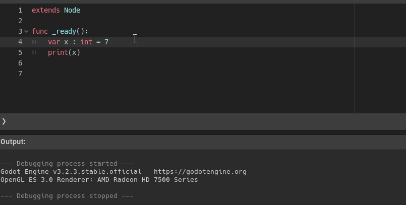

<div dir = rtl>

<div align = "center">

# السلام عليكم ورحمة الله وبركاته
## --{ تعريف المتغيرات }--
## الدرس الأول - 01
</div>

اهلا بكم في درس جديد،
سنبدأ بتعلم اساسيات البرمجة قبل الدخول في صناعة اللعبة نفسها 

قبل كل شيء عالم البرمجة بشكل عام 
يتكون من عدة محطات تعليمية
بمعنى إن كنت تريد أن تصبح مبرمج محترف عليك أن تتعلم تلك المحطات أو المستويات
```swift
- Basics الأساسيات
- Object Oriented Programming البرمجة الشيئية
- Algorithms الخوارزميات
- Datastructure هياكل البيانات
- Database قواعد البيانات
```
بالطبع لن اتطرق إلى كل هذا
سنأخذ فقط الأساسيات `basics` ولمحة عن باقي المستويات   
فلن نتعمق فيهم او ندخل في تفاصيل متقدمة ... سنأخذ فقط ما يهمنا ويجعلنا ننطلق ونصنع لعبة
بمعني آخر سنتعلم ما يبني مهاراتك ويجعلك تسير منفردًا
وان اردت ان تحترف فيما بعد فتستطيع أن تدخل بتعمق فيهم

حسنا سنبدأ مع الأساسيات
لن اشرح كل الأساسيات بالطبع
لكن ساشرح المهم والضروري منها 
## ` اذا ما المتغيرات ؟ `
المتغيرات تسمح لك بتخزين القيم والبيانات سواء ارقام او جمل او غير ذلك لتستطيع استخدامها فيما 
بعد

انواع البيانات كثيرة جدا لكننا سنتكلم عن 4 فقط 
والباقي سنعرفهم في باقي السلسلة .. ما يهم في هذا الدرس انك تعرف كيف يتم تعريف اي متغير  
نحن لن نتطرق لاي شيء عميق بشأن المتغيرات فهذا الدرس هدفه هو تعليمك كيفية تعريف المتغيرات لا 
اكثر 
<div dir = ltr>

```swift
  var VariableName : DataType = Value
```
</div>
هذا سيكون الشكل العام لتعريف اي متغير باي نوع بيانات، هيا نبدأ مع اهم انواع البيانات

## ` int `
هو اختصار ل `integer` عدد صحيح مثل `0 1 2 3 ... ` وايضا سوالب `-1 -2 -3 -4 ...`  
 لا يمكنه تخزين الاعداد الكسرية مثل `3.4` وان حاولت سيتم التخلص من الكسر تلقائيًا ويتحول `3.4` الى `3`  
كتابة المتغير قد يختلف من لغة لاخرى لكننا سنركز على لغة `gdscript` الخاصة بمحرك غودوت
في ال `gdscript` يتم تعريف المتغير هكذا 

<div dir = ltr>

```swift
  var x : int = 7
```
</div>

نكتب `var` ليعرف البرنامج اننا نريد تعريف متغير
ثم يليه `اسم المتغير` ويمكنك ان تجعله كما تشاء
لكن يفضل ان تعطي للمتغيرات اسماء تصف قيمتها 
بمعنى ان كنت تريد ان تخزن سرعة اللاعب فاجعل الاسم `speed` 

<div dir = ltr>

```swift
  var speed : int = 7
```
</div>

هكذا افضل لجعل كودك قابل للقراءه ويسهل فهمه سريعا
ثم تكتب `:` ويليه نوع البيانات `int` ثم `=` ثم `القيمة المراد تخزينها` بشرط ان تتوافق مع نفس نوع البيانات

في لغات اخرى قد يختلف شكل تعريف المتغير
على سبيل المثال في بعض اللغات يكون الشكل هكذا

<div dir = ltr>

```c++
  int speed = 7;
```
</div>

لكن كما قلنا نحن سنركز على لغة `gdscript`  
 اضافة الـ`;` في اخر السطر مسموح في ال `gdscript`  
 انه يدل على ان السطر البرمجي قد انتهى، لكن يُقترح ان لا تستعمله

لنكمل، يمكنك تعريف المتغير هكذا

<div dir = ltr>

```swift
  var x = 7
```
</div>

لكن لا يفضل تعريف المتغير هكذا بدون تحديد نوع البيانات 
لانه هكذا ال `x` ليس لها نوع بيانات محدد بالتالي
يمكنها ان تخزن اي شئ من كسور وحروف وجمل


<div dir = ltr>

```swift
  var x = 7
  x = "hello"
  x = 7.641
```
</div>

وهذا بالطبع سيء جدا جدا لان هذا يسبب مشاكل واخطاء كثيرة
لذا يفضل دائما ان تحدد نوع المتغير لتثبيت نوع البيانات
لانك ان فعلت هذا

<div dir = ltr>

```swift
  var x : int = 7
  x = "hello" # error
```
</div>

فسينبهك البرنامج فورًا ويحذرك ان المتغير `x` نوعه `int` ثابت 
لا يمكن ان يخزن غير الارقام الصحيحة

## `كيف سينبهك ؟`
اليك مثال عملي من داخل محرك غودوت

<div align = "center">



</div>

كما ترى عندما تكتب نوع بيانات محدد وادخلت له نوع مختلف سيعطيك تنبيه بخطأ  
وعندما لا تعطيه اي نوع بيانات فلن ينبهك

على اي حال يمكنك ان تعرف المتغير هكذا

<div dir = ltr>

```swift
  var x := 7
```
</div>

هكذا  البرنامج سيجعل  `x` نوع بياناته هو نوع بيانات القيمة التى ستسند له عند التعريف
بمعني ان `x` ستصبح `int` لان `7` هي `int`  
لا بأس بتعريف المتغير هكذا لكن تظل الطريقة الاولى افضل 

وايضا ان حاولت فعل هذا `var x : int = 7.8`

فقيمة `x` ستصبح `7` وسيتم تجاهل الكسور لان `x` نوعها `int`

## `float`
 حسنا نفس كل شىء لكنه يستقبل اعداد كسرية


<div dir = ltr>

```swift
  var x : float = 72.8596
``` 
</div>

لا يوجد شئ لاضيفه عليها 
كل المتغيرات تتبع نفس القواعد فالاختلاف في نوع البيانت المراد تخزينها 

## `bool`
هو اختصار  ل `boolean`
 ومعناه الحرفي هو المنطقية
هذا النوع يخزن فقط `true` و`false`  
يستخدم عادة في الشروط وهذا سنتطرق له بالتفصيل في السلسلة 

<div dir = ltr>

```swift
  var x : bool = true
```
</div>

حسنا انظر للكود التالي 

<div dir = ltr>

```swift
  var x : bool = (4 > 2)
```
</div>

## ما قيمة `x` ؟   
قيمته تحدد بالشرط المسند له هل المعادلة `(2 < 4)` صحيحة ام خاطئة ؟ 
ان كانت صحيحة فقيمة `x` تكون `true` وان كانت لا فستكون `false`

فال `bool` يخزن قيمة المعادلات هل المعادلة صحيحة ام لا

## `string `, `char`
الجمل `string` هو نوع الذي يمكنك تخزين فيها اسماء الاشياء والشخصيات بكل بساطة
وتكتب الجملة ما بين ` " " `

<div dir = ltr>

```swift
  var name : string = "Ahmed"
```
</div>

اما ال `char` فهو اختصار ل `character` وهو الحرف الواحد فقط
يكتب ما بين ` ' ' `

<div dir = ltr>

```swift
  var firstName := "Ahmed"
  var lastName  := "Ali"
  var fullName  := firstName + ' ' + lastName
```
</div>

عرفنا ثلاث متغيرات `firstName` لتخزين اول اسم 
استخدمنا الطريقة المختصرة لتعريفه ثم عرفنا  `lastName`  لتخزين التاني

ثم اخر متغير نجمع المتغيرين مع بعضهما وهذا يعني ان اخر متغير سيخزن
`Ahmed Ali` ستلاحظ وجود مسافة لاننا دمجنا حرف المسافة `' '` والمسافة هنا تعتبر حرف  
  هناك العديد من الامور لل `string` سنتطرق لها فيما بعد مثل الدوال وخواص متعلقة بالمصفوفات 
سنتحدث عنهما بالتفصيل في دروس ال `functions` و `arrays`

نحن لم نتطرق لها لان هذا الدرس هدفه هو تعليمك كيفية تعريف المتغيرات لا اكثر 
فنحن تعلمنا ان تعريف اي متغير هو كهذا 


<div dir = ltr>

```swift
  var VariableName : DataType = Value
```

</div>
</div>