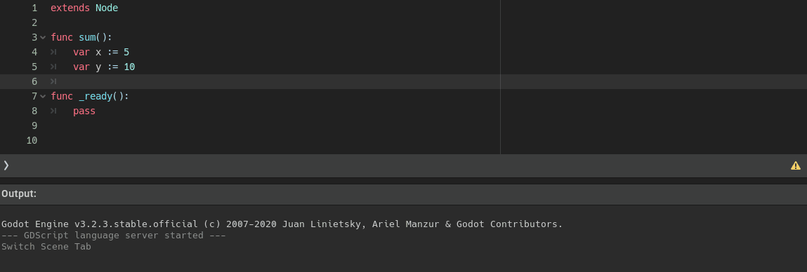

<div dir = rtl>

# السلام عليكم ورحمة الله وبركاته
## --{ الدوال }--
## الدرس الثالث - 03

اهلا بكم في درس جديد وهو الدوال  `function`   
حسنا يمكنك تخيل الدالة على انها جهاز تدخل له بعض المدخلات ثم يقوم ببعض العمليات عليها وفي النهاية يعطينا مخرجات التى تكون النتيجة المطلوبة  
دعونا نرى كيف تكتب

<div dir = ltr>

```swift
func Name():
  doSomething()
```
</div>

حسنا لتعريف اي دالة نكتب `func` ليعرف البرنامج اننا ننشئ دالة ثم `اسم الدالة` اختار اي اسم تريده ثم `( )` سنعرف ماذا تفعل قريبًا

<div dir = ltr>

```swift
func sum():
  var x := 5
  var y := 10
  print(x + y)
```
</div>


حسنا لقد انشأنا دالة خاصة بنا تدعى `sum` داخلها عرفنا متغيرين `x` و `y` واعطيتهما قيم ` 5 10` ثم نطبع مجموعهما `print(x + y)`  
الان هكذا عرفنا دالة و كتبنا داخلها بعض الاكواد .. حاليا الدالة معقلة ولن يتم تنفيذ اي كود داخلها  
### `متى يتم تنفيذ اكواد الدالة التى انشأناها ؟`

عن طريق بعض الدوال الرئيسية في محرك غودوت، تلك الدوال هي التى يبدأ من خلالها البرنامج التنفيذ والعمل

<div dir = ltr>

```swift
func _ready():
  print("Hello world!")  
```
</div>

احدى تلك الدوال التى يبدأ المحرك في تنفيذ الاكواد هي دالة اساسية جاهزة تدعى <span dir = ltr> `func _ready():` </span>   
وهي كما ترى على شكل دالة وهي احدى الدوال الاساسية الذي يتم بدأ من خلالها تنفيذ البرنامج  
وهي تتبع ايضًا `indentation`  كما ترى  
داخل الدالة كتبنا جملة الطباعة .. وعند تشغيل البرنامج سيتم طباعة الجملة  
* دالة ال <span dir = ltr> `_ready()` </span> هي  احدى الدوال الذي يبدأ من خلالها  تنفيذ البرنامج  
    سنشرها بالتفصيل عندما ندخل في الدروس الخاصة بالمحرك غودوت  
  اي بعد انتهائنا من الاساسيات بإذن الله
### `حسنا كيف سيتم تنفيذ الدالة خاصتي ؟`
حسنًا دعونا نرى المثال التالي

<div dir = ltr>

```swift
func sum():
  var x := 5
  var y := 10
  print(x + y)

func _ready():
  sum()
```
</div>

يجب ان نستدعي الدالة الذي انشأناها داخل ال <span dir = ltr> `_ready()` </span> لانها احدى الدوال الرئيسية التى يبدأ من خلالها البرنامج  
نستدعيها عن طريق كتابة اسم الدالة فقط <span dir = ltr> `sum()` </span>  داخل  ال <span dir = ltr> `ready()` </span>   هكذا سيتم طباعة `15` 

لكن هذه الدالة الذي تدعى `sum` ليست ديناميكية .. اي انها تجمع رقمين ثابتين و هما `10` `و5` والنتيجة دائما ستكون `15`  
نريد ان `نرسل لها`  اي رقمين وهي تجمعهما ... لاحظ اننا قلنا `نرسل` للدالة، حسنا كيف نرسل للدالة متغيرت لتجمعها ؟   
تعرف دالة الطباعة <span dir = ltr> `print()` </span> الذي كنا نستعملها ؟ 


<div dir = ltr>

```swift
print("hi") # it a function that receive a string and print it
```
</div>

هي كما هو واضح عبار عن دالة `ننادي` عليها `ونرسل` لها ما نريد طباعتها `داخل ( )`   
معنى هذا ان تلك الاقواس سنستعملها لجعل  الدالة خاصتنا تستقبل متغيرات

<div dir = ltr>

```swift
func sum(x, y): # the function now receive variables x, y
  print(x + y) 

func _ready():
  sum(5, 10) # pass any numbers to sum it
```
</div>

لاحظ اننا قمنا بانشاء متغيرين `x وy `داخل اقواس الدالة `sum`  
هذا معناه ان دالتنا تلك تقبل متغيرين ثم داخل الدالة نستدعى دالة الطباعة ونطبع مجموعهما  
في دالة ال `ready` قمنا باستدعاء دالة ال `sum` وارسلنا معها رقمين `اي رقمين تريدهما`  
وهكذا سيتم تنفيذ الاكواد داخل الدالة و يتم طباعة المجموع 

حسنا دعونا نسترجع تعريفنا للدالة وهي
> جهاز تدخل له بعض المدخلات ثم يقوم ببعض العمليات عليها وفي النهاية يعطينا مخرجات

حسنا لقد فهمنا كيف ندخل لها المدخلات وتجري العمليات عليها .. لكن ماذا يُقصد بـ يعطينا مخرجات ؟  
## `هل الدوال قد ترجع لنا الناتج لنستعمله ؟ ` 
نعم الدوال قد ترجع لنا قيم نستعملها في اشياء اخرى

<div dir = ltr>

```swift
func sum(x, y):
  return x + y # return the sum

func _ready():
  var z := sum(5, 10) # receive the sum and assign it to z variable
  print(z) # print value of z will be 15
```
</div>

انظر للكود جيدًا


<div dir = ltr>

```swift
func sum(x, y):
  return x + y
```
</div>

كلمة `return`  هنا تعني ان تلك الدالة سترجع لنا قيمة  
ثم تستطيع ان تستقبل تلك القيمة الراجعة من الدالة في متغير ما


<div dir = ltr>

```swift
  var z := sum(20, 10) # value of z will be 30
```
</div>

هكذا  .. فمثل ما قلنا ان الدوال كالاجهزة تستقبل مدخلات ثم تجري عليها عمليات ثم تخرج لنا بناتج العملية  
فدالة ال `sum` استقبلت رقمين ثم اجرت عليهما بعض  العمليات ثم ارجعت لنا النواتج   
فنستطيع ان نخزن ذاك الناتج في متغير واستخدامه في اي شيئ اخر


 حسنا ركز هنا .. تتذكر عندما كنا نحدد نوع المتغير هكذا  

<div dir = ltr>

```swift
  var Name : Datatype = Value 
``` 
 </div>  

 كنا نكتب `:` ثم نوع البيانات <span dir = ltr> `var x : int` </span>  كنا نفعل هذا لمنع حدوث خطأ وينبهنا البرنامج بذلك
 
 يمكننا عمل نفس الشيئ مع المتغيرات التى تستقبلها الدوال

<div dir = ltr>

```swift
func sum(x : int, y : int): # to make sure the type of x, y is integer
  return x + y

func _ready():
  var z := sum(5, 10)
  print(z)
```
</div>

 
 هكذا مثل ما هو موضح في الكود .. ماذا سنستفيد من تحديد النوع ؟

 <div align = "center">


</div>

## سنستعمل بعض الصور من داخل محرك غودوت فقط للتوضيع

كما هو واضح في الصورة انه عند تحديد نوع البيانات  
سينبهنا البرنامج بان هناك خطأ في حال ادخال بيانات مختلفة  
قد تجد الموضوع تافه وبسيط وانك لن تغلط في الادخال  
لكن ان كنت تعمل في مشروع كبير فستحدث لك اخطاء عديدة من هذا النوع وانت لا تدري

## `ماذا سيحدث ان لم نكتب النوع ماذا سيحدث ؟`


<div align = "center">


</div>

ان لم نكتب النوع قد نرسل بيانات غير صحيحة للدالة دون ان ندري والبرنامج `لن ينبهنا`  
فقد نستمر في كتابة العديد من الاكواد والامور وهناك خطأ لا ندري عنه سيسبب لك مشاكل لاحقًا

حسنا لقد انتهينا من شرح اساسيات الدوال .. وقبل ان ننهي سنتكلم عن ال `pass`  
ان انشأت دالة ولا تريد كتابة شيئ داخلها في الوقت الحالي   
في البرنامج ان فعلت هذا سيعطيك خطأ  
لكن انت ستريد انشاء دوال متعددة ولا تريد كتابة شيئ فقط تريدنا موجودة فارغة لتتذكرها او تستعملها في وقت لاحق   

هنا يأتي دور ال `pass`


<div align = "center">



</div>

لاحظ اننا حصلنا على خطأ عندما لم نكتب شئ داخل الدالة وأختفى عندما كتبنا `pass`
هي تساعد في كتابة دوال فارغة دون الحصول على خطأ

في الحقيقة هي لا تختصر على الدوال .. يمكنك استخدامها مع اي شيئ يدعم `indentation`   
مثل ال `if else` في الدرس السابق


<div dir = ltr>

```py
var x := 7

if x == 8:
  print(x)

elif x == 10:
  pass # this codition will not do anything right now

else:
  print(x + 5)
```

</div>

الأمر كانك تريد ان تتجاهل شيئ لكن لا تريد حذفه ايضًا  
فهنا الشرط موجود لكن لا يفعل شيئ في الوقت الحالي

* ملاحظة اخيرة هناك نوعان اساسيان للدوال 
  - `bulit-in functions`  
  وهي دوال جاهزة داخل البرنامج  بمعنى انك لم تنشئها لانها موجودة بالفعل وتم انشاءها مسبقا ودمجها داخل البرنامج  
  انت فقط تستدعيها وتستخدمها ولا تتلاعب بالاكواد التى بداخلها  
  مثل
      - <span dir = ltr> `_ready()` </span>
      - <span dir = ltr> `_physics_process()` </span>
      - <span dir = ltr> `print()` </span>
      - <span dir = ltr> `etc...` </span>

  - `user-defined functions`  
  وهي الدوال التى تنشيئها انت بنفسك مثل ما فعلنا وانشاءنا دالة خاصة بنا تدعى <span dir = ltr> `sum()` </span>
  
  
  هذا كل شيئ .. الدوال سنستعملها كثيرًا في الدروس القادمة والمشاريع سواء دوال جاهزة في البرنامج او دوال تنشئها بنفسك

</div>
