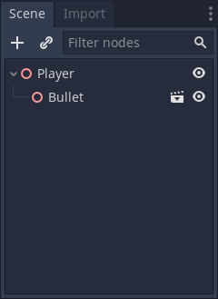
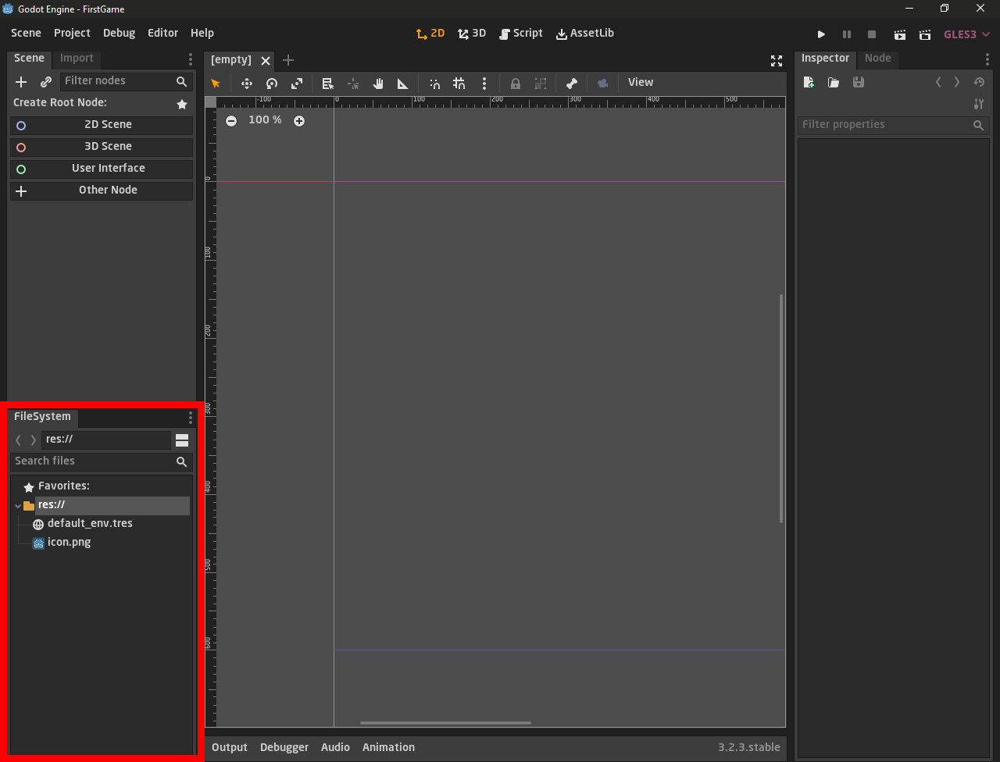

# السلام عليكم ورحمة الله وبركاته
## --{ مكونات المحرك }--
## الدرس الثامن - 08

نبدأ اول شرح لنا في محرك غودوت وسنتكلم في هذا الدرس عن مكونات المحرك  

### `طريقة عمل المحرك`
كل شيء في غودوت هو عبارة عن عقدة، فمثلا، اللاعب والسلاح والأرض... الخ، فهُم عُقد، تستطيع وضع اكثر من عقدة في مشهد واحد،  
 وإن وضعت عقد كثيرة في مشهد واحد سيصبح لديك شيء اسمه `SceneTree`.  
فمثلا لنصنع عقدتان احداهما بأسم اللاعب والأخرى بأسم الطلقة،  
أولا اللاعب: يجب ان ننشئ مشهد، ثم نضع العقد اللازمه لإنشاء اللاعب، من ثم نحفظ المشهد.  
أما بالنسبه للطلقة، فسنحتاج فقط Sprite لتحمل شكل الطلقة، ثم نحفظ مشهد الطلقة.  
يمكن للعقد أن يكون لها أبناء عبارة عن مشهد, مثلا:

هذا كان مجرد شرح نظري، سنعرف ما المقصود بكل هذا في الدروس القادمة
لذا سنكتفي بهذا المقدار من الشرح النظري، اما فالأن سنبدأ بالشرح العملي حبة تلو الأخره .

### `ملحوظة`
*  سيتم شرح مكونات واجهه المحرك فقط ولن نتعمق في هذا درس في تفاصيل عملية  
   سيتم شرح كل شيء جديد وغريب تسمعه هنا في درس منفصل وسيتم التنبيه على هذا الامر
## `تحميل المحرك`
قبل كل شيء تستطيع تحميل المحرك  من خلال هذا الرابط من الموقع الرسمي بشكل مجاني  
https://godotengine.org/download/windows

إختار نوع نظلم التشغيل الخاص بك  
ثم ستجد نسختين نسخة `Standard` و ال `Mono` التى تعمل بلغة  `C#`    
نحن سنحمل ال `Standard` لان `Mono` ليست مستقرة حاليًا ونحن سنقوم باستخدام لغة `gdscript` على اي حال  
قد نصنع سلسلة خاصة لنسخة ال  `Mono` في المستقبل بإذن الله  

مساحة المحرك صغيرة جدا لذا لن يستغرق التحميل وقت طويلا   

## `خطوات عمل المشروع`
مثل ما هو موضح في الصورة التالية  

ملاحظه: ألون الواجهه في الصور قد تختلف عن واجهتك; لأنني غيرت الـ `Theme`.

عند فتح المشروع سيظهر بهذا الشكل الذي امامنا  
هذه هي واجهه محرك غودوت  

## `نوع مشهد اللعبة`
الجزء المحدد هو المكان الذي يظهر فيه عالم اللعبة الخاصة بنا  
ومفتوح على مشهد `ثلاثي الابعاد` كما ترى ويمكنك ان ترى المحاور الثلاثة` x, y و z`

لن نتعامل مع الثلاثي الابعاد في هذه السلسلة لذا نحتاج الى جعل المشهد يكون `ثنائي الابعاد
`

يمكنك جعل المشهد ثنائي الابعاد عن طريق الضغط على الايقونة المشار اليها بالسهم  
سيتم تحويل الشاشة تلقائيا الى مشهد ثنائي الابعاد وتستطيع التعامل معها عبر المحاول `x و y`  

## `المشهد`
المشهد `scene` هو المكان الذي يتم فيه بناء العناصر اوالمكونات الذي تكون العالم الخاص باللعبة او الشخصيات او اي عنصر في اللعبة  

على سبيل المثال `اللاعب`  
يتكون من عدة اجزاء منها  
* `sprite` هو الشكل العام للاعب
* `collision shape` حدود او منطقة التصادم
* `script` الاكواد التى نكتبها للشخصية  
وامور اخرى ..  
هذه الاجزاء تدعى `node` اي عقدة  
كل هذا يتم بنائه وتجميعه في مشهد واحد لنكون شخصية اللاعب

### `تنبيه`
*  سيتم توضيح هذه الامر وامور مثل `scene, node, script` وغيره في درس اخر بالتفصيل بإذن الله 

## `ملفات المشروع`
هنا بكل بساطة يتم حفظ جميع الملفات التى تستخدمها في اللعبة  
سواء صور، اصوات، اكواد، شخصيات، .. الى اخره من الامور  
يمكنك ان تتصفح كامل المشروع هنا   
- ### لذا يفضل دائما ان تنظمه اول بأول ليسهل عليك ان تجد الاشياء ولا تتوه في المجلدات والملفات

ستلاحظ اننا نعمل في مجلد رئيسي يدعى  `res://`  هو الجزر الرئيسي لمشروعك  
عندما نتعامل مع المسارات وتريد احضار المسار الخاص بملف معين ستبدأ المسار ب  `res://`   

## `منطقة الخواص`
عندما تحدثنا عن المشهد `scene` قلنا انه المكان الذي نبني فيه الشيء الذي نريده سواء كان عدو او اللاعب او ما شابه  
الاجزاء التى تكلمنا عنها مثل ال  `sprite` و `collision` تدعى `node`  اي عقدة تتكون من عدة خواص بداخلها  
فهذه الخواص نتحكم بها في هذه المنطقة `inspector` المعنى الحرفي لها هو مراقب او مفتش   
لكن يقصد بها ان هذا المكان هو الذي تراقب فيه كل خواص الاشياء التى سنستخدمها  
سنرى ذلك في الدرس القادم بوضوح  

## `قائمة المساعدات`

هذه القائمة مهمة جدا لانك تستطيع الوصول لكل المستندات وتعرف تفاصيل عن اي شيء تريده

ان فتحنا نافذة البحث  
`Help => Search  `
ستجد هنا كل الاصناف الجاهزة الخاصة بمحرك غودوت `built-in class` وجميع الدوال الجاهزة `built-in functions ` 
يمكنك اختيار اي شيء وتعرف كل تفاصيله

هنا فتحنا صنف العقدة `class node` ستجد هنا وصف له كما ترى وتفاصيل عنه  

 وان نزلنا قليلا لاسفل ستجد جميع المتغيرات والدوال التى يحتويه هذا الصنف  
 وستجد  بالطبع نبذه عن كل شيء وكيفية استخدامه وما الذي يفعله

هذا اهم المكونات التى اريد ان اشرحها في هذا الدرس  
في الدروس القادمة سنشرح الامور بشكل عملي اكثر

