<div dir = rtl>


<div align = "center">

# السلام عليكم ورحمة الله وبركاته
## --{المفاهيم الأساسية}--
## الدرس التاسع - 09
</div>

سندرس في هذا الدرس `3` من اهم المفاهيم الاساسية التى ستكرر دائما في محرك غودوت وهم `Nodes, Scenes, Scripts`

## `العُقد Nodes`
`Nodes` العقد هو مصطلح متواجد في محرك غودوت وهو عبارة عن صنف `class`  
اي انه عبارة عن مجموعة من المتغيرات والدوال التى تصف وظيفة هذا الصنف او العقدة  
يمتاز غودوت باحتوائه على العديد من العقد الجاهزة التى تساعدك في انشاء مشروعك سواء كانت ثنائية الابعاد او ثلاثية  
سنتكلم عن اهم العقد التى سنستعملها بكثرة وبشكل اساسي اثناء هذه السلسلة  

## `إنشاء شخصية اللاعب`
سنبدأ إنشاء شخصية اللاعب الخاصة بنا لنعطي مثالا عمليا اثناء الشرح  
 والعقدة التى ستساعدنا في إنشاء اللاعب تسمى `KinematicBody2D`  
هذه العقدة لها متغيرات ودوال ستساعدنا في التحكم بالشخصية وتحريكها وفعل ما نريده بها  
لأستحضارها نتبع الخطوات الأتية نضغط على  

<div dir = ltr>

`Other Node => Node2D => CollisionObject => PhysicsBody2D => KinematicBody2D` 

</div>

ثم غيرنا الأسم الى `Player` ليعبر عن الشخصية لا اكثر

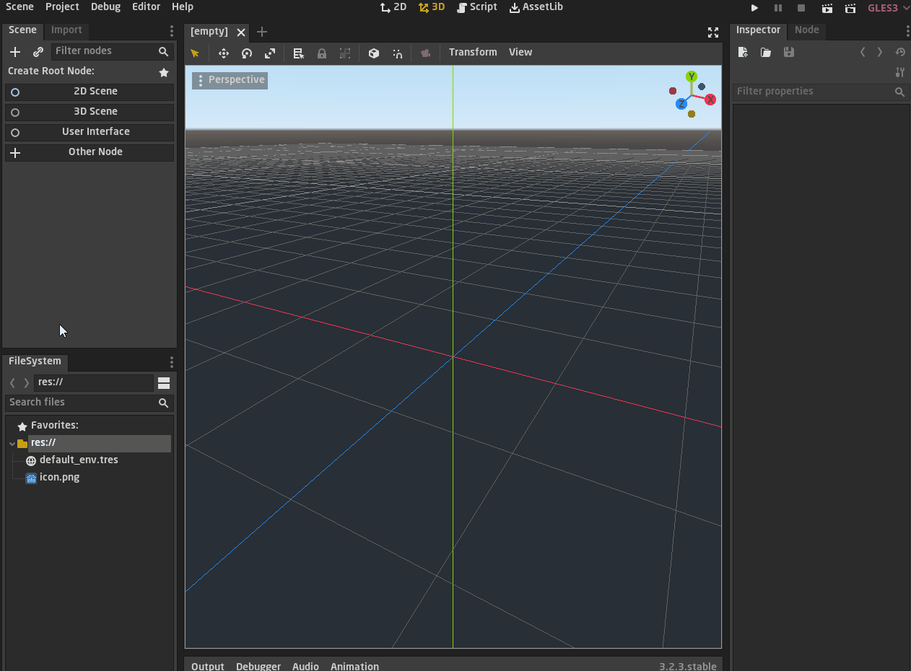

## `حفظ المشهد`
بعد ما استحضرنا اللاعب سيتم إنشاء مشهد خاص به، به عقدة واحدة فقط وكما قلنا ان المشهد `scene` هو المكان الذي يتم فيه بناء العناصر اوالمكونات الذي تكون العالم الخاص باللعبة او الشخصيات او اي عنصر في اللعبة  
هنا المشهد سيكون للشخصية وسنرى كيف سنبني مكوناته  
لحفظ المشهد نضغط  `Ctrl + S` ثم نحفظه في مجلد لننظم الملفات والمجلد الخاص بالمشروع  
من الجيد ان تبدأ بالتنظيم من الأن لكي لا يتراكم عليك الأمر في المستقبل وتتوه ويصعب عليك التنظيم  

<div align = "center">

  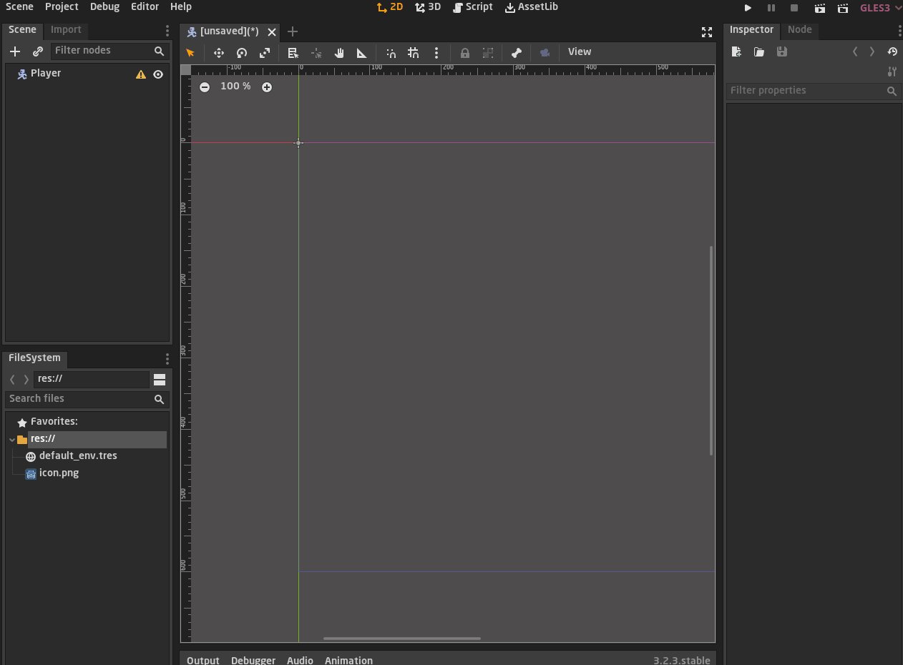
</div>

ستستطيع رؤية كل الملفات هنا وصيغة المشهد تكون `tscn` وهو اختصار ل `Text Scenes`
هناك صيغة اخرى تدعى `scn`  
والفرق بينهما تم الاجابة عليه في [هذا السؤال](https://godotengine.org/qa/5447/what-are-diffrence-between-scn-and-tsn-which-one-is-better)

<div dir = ltr>

> .tscns are "Text Scenes", meaning they're written in a human readable format. You can open them in a text editor to see. They are also friendlier to version control, so you can have meaningful diffs if using Git, Svn or something of the like.  
.scns are binary scenes. They tend to be smaller and faster to load. If you have a huge scene (like in 3D with a lot a geometry data) it's the best format to use.  
Note that .tscn is converted to .scn at export time, so you won't lose performance in your game release.

</div>

مختصره انه لا فرق كبير سوي ان `tscn` يترجم بيانات المشهد لمهلومات يمكن ان يفهمها المطور  
على سبيل المثال في المشهد الخاص بنا ان فتحته كملف نصي فسيظهر لك هكذا  

<div dir = ltr>

```
[gd_scene format=2]

[node name="Player" type="KinematicBody2D"]
```
</div>

هذه معلومات المشهد الذي انشأناه منذ قليل

وهناك تنبيه ان ال `scn` يكون اسرع من `tscn` لكن اثناء تصدير المشروع سيتم تحويل جميع مشاهد `tscn` الى `scn` لذا لا تقلق من هذا الامر

<div align = "center">

  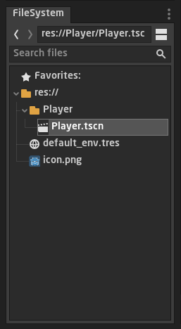
</div>

## `تشغيل مشروع`
لنحاول تشغيل المشروع ونرى ماذا سيحدث

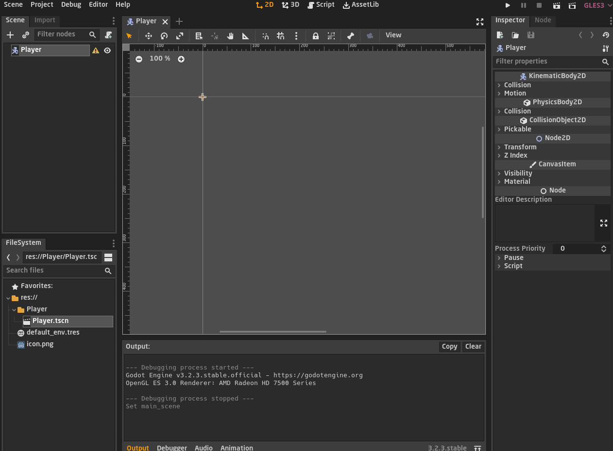

في البداية سيسألك عن المشهد الافتراضي الذي سيبدأ المشروع به
نحن كبداية سنقول ان المشهد الافتراضي للمشروع هو مشهد اللاعب  
نحن يمكننا ان نغيره فيما بعد

<div align = "center">

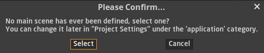
</div>

تستطيع تعين المشهد الافتراضي عن طريق الاعدادات كما هو موضح هنا 

<div dir = ltr>

`Project => Project Settings => General => Application => Run => Main Scene`

</div>

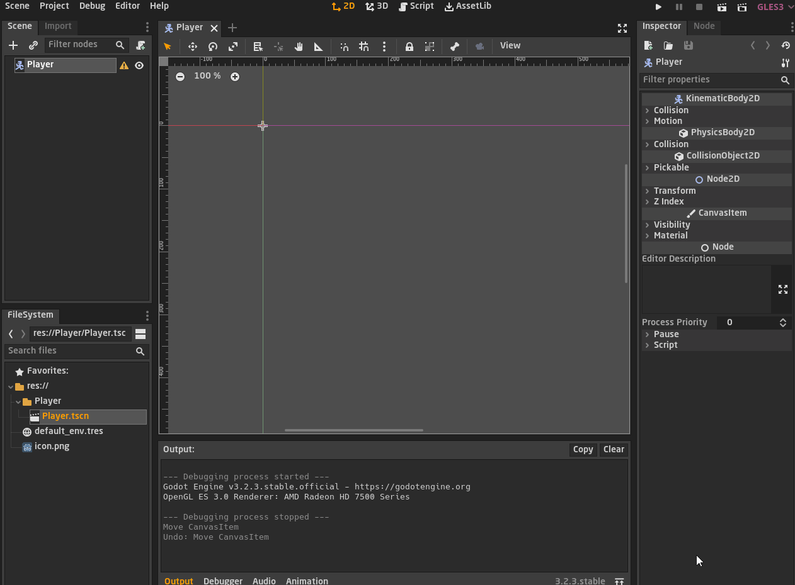

## `Sprite`

ليس له ترجمة معينة لكن المعنى العام هو انه رسم للشخصية او شكله الافتراضي
في غودوت لدينا عقدة تمثل هواص ال `sprite` 

لأضافة شكل للشخصية نضغط على عقدة اللاعب بالزر الايمن للفارة ثم نختار  

<div dir = ltr>

`Add Child Node`

</div>

ستظهر لك قائمة بكل العقد، نستطيع ان نبحث عن عقدة الشكل كتابة اسمها `sprite`

ستلحظ وجود خواص العقدة في قائمة ال `Inspector` وكما قلنا انها قائمة المراقبة بها كل بيانات العقدة  
ستجد حقل ال `texture` وهو حقل يطلب منك النقش او الشكل اي يطلب منك رفع صورة لشكل الشخصية  
لقد اخترنا شكل افتراضي في الوقت الحالي وهي ايقونة غودوت  

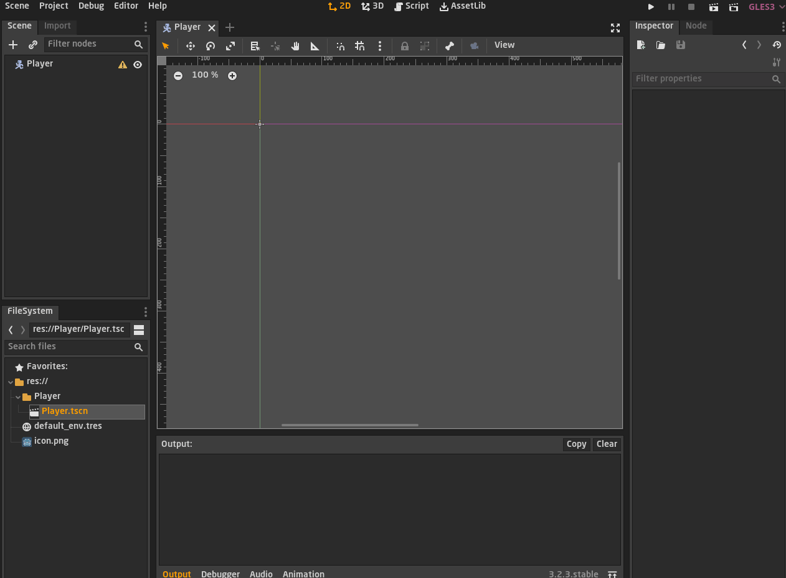

لنحاول تشغيل المشروع ونرى ماذا سيحدث  
ستلاحظ ان اللاعب في الاعلى اقصى اليسار

لذا نحتاج ان نحركه يدويا قليلا لجعله في المنتصف لنستطيع ان نراه  
في ال `inspector` هناك حقل يدعى `transform` اي الحركة العامة هو الذي نستطيع ان نغير فيه اماكن وحجم الشخصية  

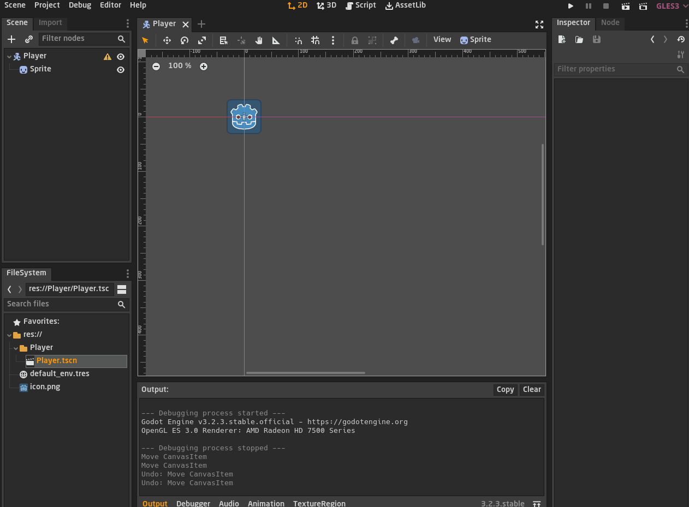

في حقل `transform` نستطيع التلاعب بموقع وحجم واتجاه اي صورة  

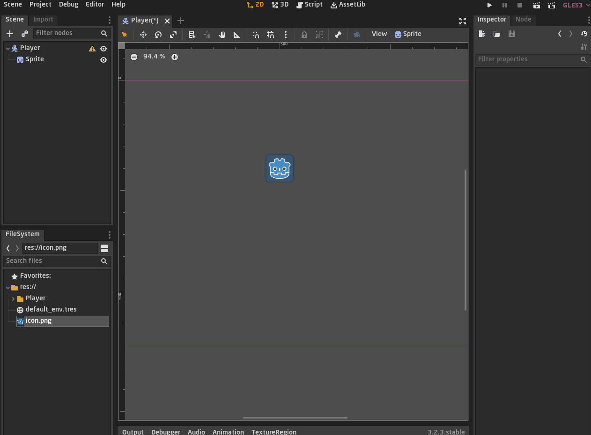

لكن قد تكون لاحظت ان الصورة بها بعض التشويش قليلا
لان اعدادات محرك غودوت الافتراضية لا تدعم الصور المبكسلة `pixel image` لذلك علينا ان نغير هذا من الاعدادات  
نضغط على ال `sprite` ثم 
<div dir = ltr>

`Import => Preset => 2D Pixel `

</div>

ثم نضغط على `Reimport`

ثم لا ننسى ان نجعل ما اخترناه هو الاختيار الافتراضي حين نستحضر اي صورة  
الاختيار بالطبع يختلف على حسب نوع رسومات لعبتك الانر عائد الى نوعية الرسومات

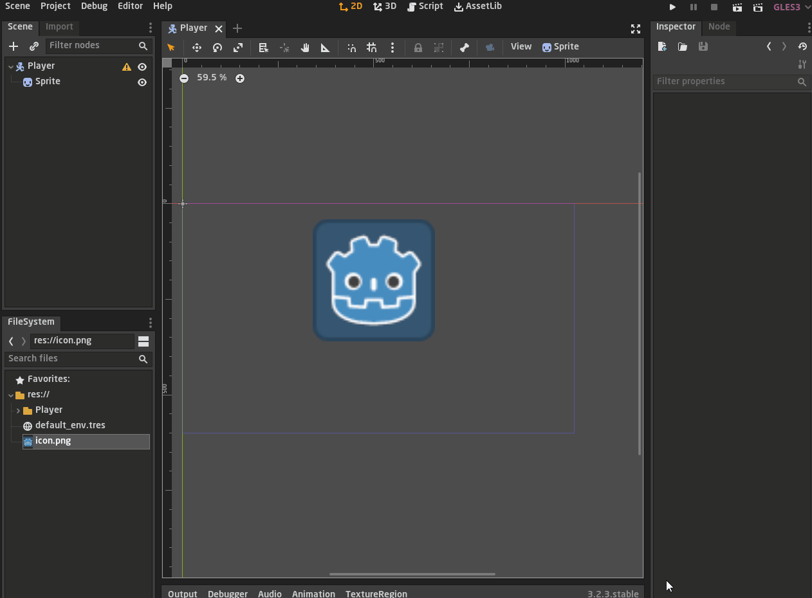

## `النص البرمجي`
نأتي لاخر جزء في هذا الدرس وهو ال `script` النص البرمجي الذي نستطيع ان نبرمج فيه اللعبة خاصتها واي شخصية او كائن او اي شيء داخل لعبتنا نحتاج لان نبرمجه لفعل شيء معين

كل عقدة نستطيع ان نبرمجها بشكل مستقل بنص برمجي منفصل
ناتي في المشهد ونختار العقدة الرئيسة التى فأعلى المشهد ونرفق لها الملف النصي
يفضل ان ترفق الملف في اعلى عقدة لتستطيع ان تتحكم في جميع العقد التى تحتها  وسنرى ذلك فيما بعد  

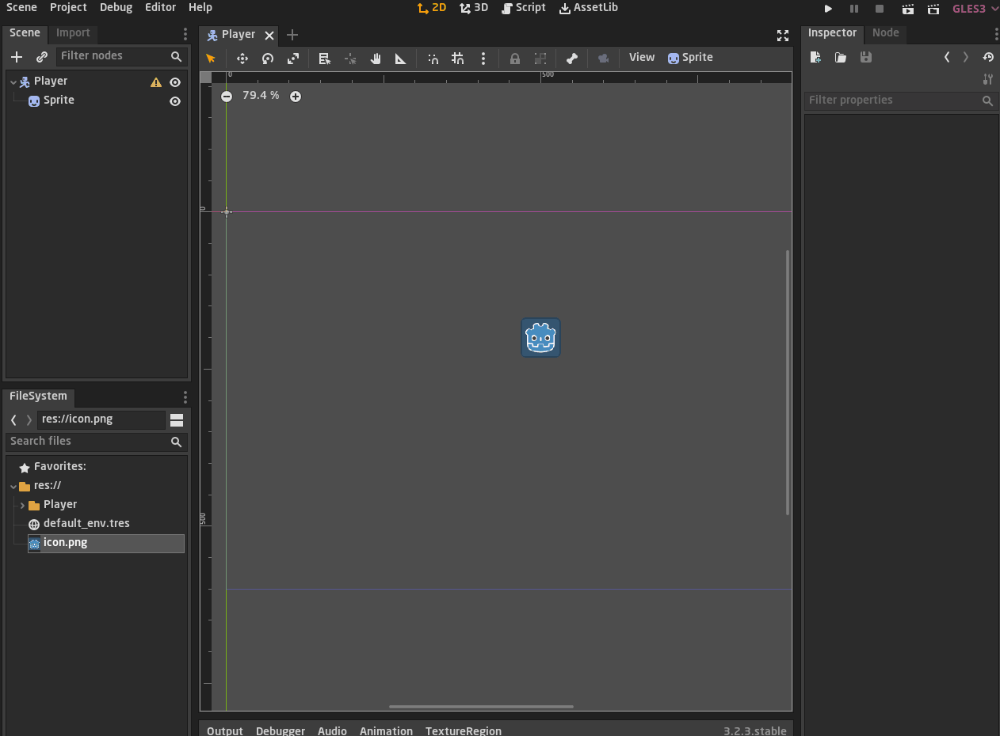

الملف يكون مكتوب فيه بعض الاكواد البرمجية الافتراضية التى تعطي بعض الارشادات البسيطة كما ترى

<div dir = ltr>

```swift
extends KinematicBody2D


# Declare member variables here. Examples:
# var a = 2
# var b = "text"


# Called when the node enters the scene tree for the first time.
func _ready():
	pass # Replace with function body.


# Called every frame. 'delta' is the elapsed time since the previous frame.
#func _process(delta):
#	pass
```
</div>

حسنا في الدرس القادم سندخل في البرمجة بإذن لله

</div> 