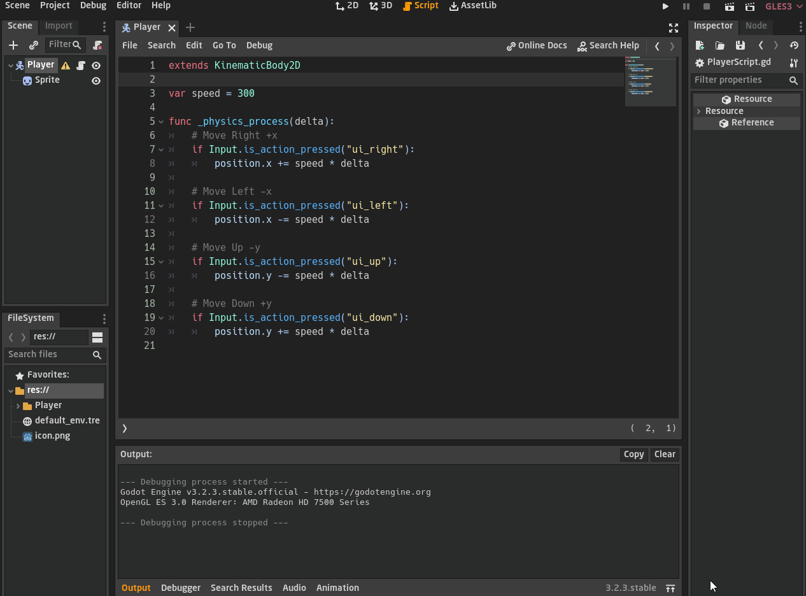

<div dir = rtl>

<div align = "center">

# السلام عليكم ورحمة الله وبركاته
## --{الحركة}--
## الدرس العاشر - 10

</div>

## `extends & _ready() function`
في نهاية الدرس السابق انشأنا ملف نص برمجي وارفقناه بالعقدة الرئيسية الخاصة باللاعب  
هذا الملف هو الذي نستطيع فيه كتابة الاكواد البرمجية لنستطيع التحكم باللاعب كما سنبين في هذا الدرس

في اول سطر فيه سنلاحظ وجود `extends KinematicBody2D` اي ان هذه العقدة تحتوي خواص صنف الـ `KinematcBody2D Class`   
اي اننا نستطيع ان نستخدم الدوال والمتغيرات والخواص التى سيعطيها لنا هذا الصنف  
كما قلنا ان لكل عقدة خواصها المميزة التى تقوم بالغرض الذي أُنشِئت لها  

ثم لدينا دالة الـ `ready`
وكما نعرف انها أحد الدوال الرئيسية التى يبدأ البرنامج بالقراءة من عندها `وتنفذ مرة واحدة فقط`  
عندما كتبنا داخل الدالة `print("Hello")` ثم بدأنا تشغيل المشروع او اللعبة  
نلاحظ طباعة الكلمة، بمعنى ان البرنامج بدأ التنفيذ من دالة الـ `ready`


## <span dir = ltr> `_physics_process(delta)  function` </span>

الـ `physics_process` مثلها مثل دالة الـ `ready` اي انها أحد الدوال الرئيسية التى يبدأ البرنامج بالقراءة من عندها  
لكن `يتم تنفيذها عدة مرات` وليس مرة واحدة فقط  
كما نلاحظ انه عند تشغيل اللعبة تم طباعة الكلمة عدة مرات ويتم تنفيذها دائما طوال تشغيل البرنامج  


## `هل السرعة ثابتة ام متغيرة ؟`

عندما نتحدث على السرعة فيجب ان نتحدث عن الـ `delta` وهي سرعة التى يتم فيها تنفيذ الإطارات `frames`  
اي السرعة ما بين  الإطار الحالي والإطار للثالى  

بالنسبة لتغير السرعة فلدينا هنا دالتنين متشابهتين وهما  

<span dir = ltr> 

`_physics_process(delta), _process(delta)`

</span>

اختلافهم واضح في الصورة التالية  
في دالة الـ `physics_process` تكون الـ `delta` ثابتة  
في دالة الـ `process` تكون الـ `delta` متغيرة  

### `لكن ما سبب التغير او ما الذي يؤثر عليه وهل الثابت سيء ام جيد ؟`


## <span dir = ltr> `_physics_process(delta) vs. _process(delta) function` </span>

ما سبب التغير واي دالة نستخدم ؟

*  <span dir = ltr> `_process(delta)` </span>
    - قيمتة متغيره لانه يعتمد على امكانيات الجهاز اي انه يختلف من جهاز لآخر
    - لا ينصح استخدامه دائما في كل شيء
*  <span dir = ltr> `_physics_process(delta)` </span>
    - قيمتة ثابتة دائما على كل الاجهزة
    - ينصح باستخدامه دائما لكي تكون سرعة اللعبة ثابتة على جميع الاجهزة  
  
هل معنى هذا اننا لا يجب ان نستهدم الـ `process` ؟   
 لا نحن نستطيع لكن في حالات معينة لكي نستطيع ان نستخدم كل امكانيات الجهاو ونحافظ على سرعة الثابتة، سنعرف كيف في الدروس القادمة   
 نحن حاليًا سنستحدم  <span dir = ltr> `_physics_process(delta)` </span>

## `مواقع العُقد`

هناك مشكلة علينا الانتباه لها ستلاحظ هنا ان العقدة الرئيسية الخاصة باللاعب احداثياتها هي `(0 ,0)`  
وعقدة الشكل `sprite` احداثياتها `(200 ,500)`  
وهذا الامر خطأ  كيف لللاعب ان يكون في مكان وشكله في مكان اخر تماما  
لذا سنرجع الشكل الى نقطة الاصل مع اللاعب

 

## `ربط العُقد بالعقدة الرئيسية`

سنلاحظ انه بعد ان ارجعنا شكله الى نقطة الاصل ثم حاولنا تحريك اللاعب   
سنجد ان الشكل `sprite` هو الذي يتحرك وليس اللاعب ككل  

لنحل هذه المشكلة  نرجع الشكل الى نقطة الاصل ثم نختار عقدة اللاعب الرئيسية  
سنجد خيار في شريط الخواص في الاعلى على شكل مربعين


نضغط عليه، ما يقوم به هذا الخيار هو انه يمنعك من تحريك العقد التى تندرج تحت العقدة الرئيسية  
بالتالي عندما تحرك العقدة الرئيسية فسيتم تحريكها كاملها هي والعقد التى تندرج تحتها  


## `الإحداثيات`
الأن سنتكلم عن الإحداثيات `position` سنجد اننا لدينا `keyword` كلمة رئيسية بهذا الاسم  
وعندما نطبعها ستعطينا احداثيات العقدة المرفوقة بالنص البرمجي `script` الذي نكتب فيه الان

ايضًا نستطيع الوصول الى اي احداثي نريده سواء `x` او `y` عن طريق كتابة `position.x` و`position.y`


## `Vector2`  

قبل ان نكمل علينا ان نتكلم عن نوع جديد ومهم من انواع البيانات وهو `Vector2` 
وهو بكل بساطة يسمح لنا بتخزين قيمتين من نوع `float`  

<div dir = ltr>

```swift
    var p := Vector2()
    p.x = 200
    p.y = 100

    print(p) # it will print (200, 100)

```

</div>

الـ `Vector2` بداخله الكثير من العناصر مثل `x` و `y` و `abs` لإجاد القيمة المطلقة بين `x` و`y`  

يمكنك ان تتفقد عناصره وتعرف خواصه في الـ `docs` الخاص بالمحرك  
`Help => Search`  
ثم تبحث عن `Vector2`  


### `انتبه قليلا هنا`  
 لا يمكنك فعل هذا `p += 50` لان الـ`50` من النوع `int` وهو لا يتوافق مع النوع `Vector2`  
والصحيح ان تزود بنفس نوع البيانات هكذا   `p += Vector2(50, 50)`

<div dir = ltr>

```swift
    var p := Vector2()
    p.x = 200
    p.y = 100

    p += 50 # Error
    p += Vector2(50, 50) # Correct

```

</div>

بالتالي نستنتج ان `position` من النوع `Vector2`  
ان اردت ان تعرف اي معلومات عنها او عن اي شيء اجعل الفأرة عليها ثم اضغط `Ctrl + Click`  
سيتم نقله الى صفحة ال `docs` الخاصة به كما ما هو موضح بالصورة التالية  


## `الحركة`

حسنًا نحن كنا نزود على الاحداثيات الخاصة باللاعب في دالة الـ `ready`  
ونحن نعرف انه هكذا سيتم تنفيذ الاوامر مرة واحدة فقط  
لكن ماذا ان كتبنا نفس الامر في دالة الـ `physics_process ` 

هكذا نستطيع حرفيا ان نحرك اللاعب بتغير احداثياته كما هو موضح في الصورة  


## `احداثي الـ y معكوس ؟`

من الامور التى يجب ان تنتبه لها جيدًا ان احداثي الـ `y` معكوس  
بمعنى ان الموجب في الاسفل والسالب في الاعلى   
واحداثي الـ `x` طبيعي  لم يتغير، اي ان الموجب في اليمين والسالب في اليسار


## `التحكم بالحركة`

الان نريد ان نتحكم بحركة اللاعب بانفسنا، نضعك على اسهم لوح المفاتيح ونحركه  
لنفكر ماذا نريد ان نفعل، نحن نريد انه إذا نضغطتنا على زر السهم الايمن يتحرك اللاعب الى اليمين  

الأمر اشبه بـ 

<div dir = ltr>

```swift
    if Input is right arrow :
        then move the player to right
```

</div>

#### `حسنا كيف نعرف الزر الذي يضغطه اللاعب ؟`

لدينا صنف جاهز `built-in class` يقوم بهذا الواجد وهو `Input` هو هو اسم الصنف  
بداخله دوال وعناصر ستساعدنا في معرفة اي زر ضغطه اللاعب

منها دالة تدعى `is_action_pressed` وهي دالة اسمها عبارة عن سؤال يوضح ما وظيفتها  
هذه الدالة قد لاحظت انها تاخذ متغير من النوع جملة `string`  
كما هو موضح في الصورة هناك العديد من الازرار الرئيسية، نحن اخترنا ما يرمز لليمين كما ترى  

الدالة ترجع قيمة `boolean` بمعنى انه عندما يتم الضغط على الزر المحدد  سيرجع لنا `true`  
وعندما لا يتم الضغط سيعطي `false`
ثم سيتم استقبال قيمة ال `boolean` في الشرط `if` ويتم تنفيذ الاسطر التى تحت ال `if`  


هناك 3 دوال متشابهه عليك ان تفرق بينهم جيدًا وهم  
<div dir = ltr>

```swift 
is_action_pressed("ui_right")

is_action_just_pressed("ui_right")

is_action_just_released("ui_right")

```

</div>

* <span dir = ltr> `is_action_pressed()` </span>
    - يعطي `true` طالما مازال الزر مضغوطًا
* <span dir = ltr> `is_action_just_pressed()` </span>
    - يعطي `true` عند لحظة الضغط فقط
* <span dir = ltr> `is_action_just_released()` </span>
    - يعطي `true` عند لحظة انتهاء الضغط

## `مثال توضيحي`  


عندما تدخل الى ال `docs` الخاص بصنف `Input` ستجد العديد من الدوال، منها ..  

<div align = "center">


</div>

## `الأتجاهات الأربعة`  

حسنا لنجعل اللاعب يتحرك في الاتجهات الاربعة 
مثل ما فعلنا مع اتجاه اليمين سنفعل مع الباقي  

### `تذكر`
احداثي الـ`y` معكوس، الموجب في الاسفل والسالب في الاعلى

<div dir = ltr>

```swift
func _physics_process(delta):
    # Move Right +x
	if Input.is_action_pressed("ui_right"):
		position.x += 1

	# Move Left -x
	if Input.is_action_pressed("ui_left"):
		position.x -= 1
	
	# Move Up -y
	if Input.is_action_pressed("ui_up"):
		position.y -= 1
	
	# Move Down +y
	if Input.is_action_pressed("ui_down"):
		position.y += 1
```

</div>


## `السرعة`

ستلاحظ ايضًا اننا نستطيع ان نتحرك في الزواية مع الضغط على زرين في آن واحد  

### `يبقى سؤال هل ان اردنا تغير سرعة اللاعب نغير القيمة العددية المسندة في الاتجاهات الاربعة ؟`  

بالطبع لا، هناك حل بسيط وهو اننا ننشئ متغير فاليكن اسمه `speed` اسم يعبر عن وظيفته وهي تخزين سرعة اللاعب  
ثم نسند المتغير `speed` للاتجاهات الاربعة  وكلما اردنا تغير السرعة نقوم فقط بتغير هذا المتغير  


<div dir = ltr>

```swift
var speed = 2

func _physics_process(delta):
    # Move Right +x
	if Input.is_action_pressed("ui_right"):
		position.x += speed

	# Move Left -x
	if Input.is_action_pressed("ui_left"):
		position.x -= speed
	
	# Move Up -y
	if Input.is_action_pressed("ui_up"):
		position.y -= speed
	
	# Move Down +y
	if Input.is_action_pressed("ui_down"):
		position.y += speed
```

</div>

حسنا هذا جيد، لكن يبقى شيءٌ اخيرٌ هنا تتذكرون `delta` انها سرعة الاطارات `frames`  
اي اننا ان ضربناها في السرعة سيجعل سرعة اللاعب تتوافق مع سرعة الاطارت والجهاز  
وفوق هذا سيجعل حركة اللاعب سلسلة اكثر لذا كل ما سنفعله اننا سنضربه في السرعة  
وبما ان قيمته كسرية لا تتعدى الواحد صحيح علينا زيادة قيمة ال `speed`


<div dir = ltr>

```swift
var speed = 300

func _physics_process(delta):
	# Move Right +x
	if Input.is_action_pressed("ui_right"):
		position.x += speed * delta

	# Move Left -x
	if Input.is_action_pressed("ui_left"):
		position.x -= speed * delta
	
	# Move Up -y
	if Input.is_action_pressed("ui_up"):
		position.y -= speed * delta
	
	# Move Down +y
	if Input.is_action_pressed("ui_down"):
		position.y += speed * delta
```

</div>

### `كل شيء موضح في الصورة التالية`  



حسنًا هذا كل ما لدي في هذا الدرس، في الدوس القادم سنتعلم كيف نحسن السرعة بإذن الله

</div>