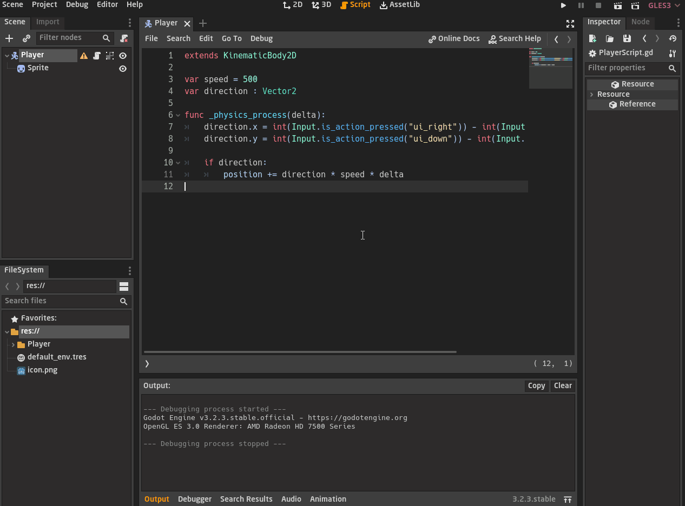
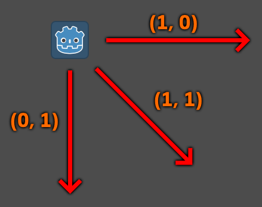
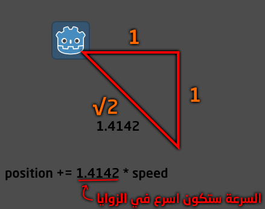
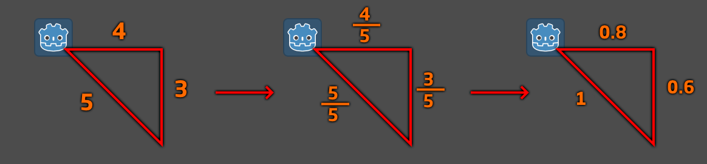
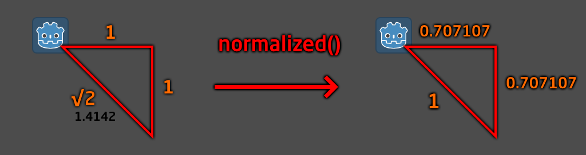
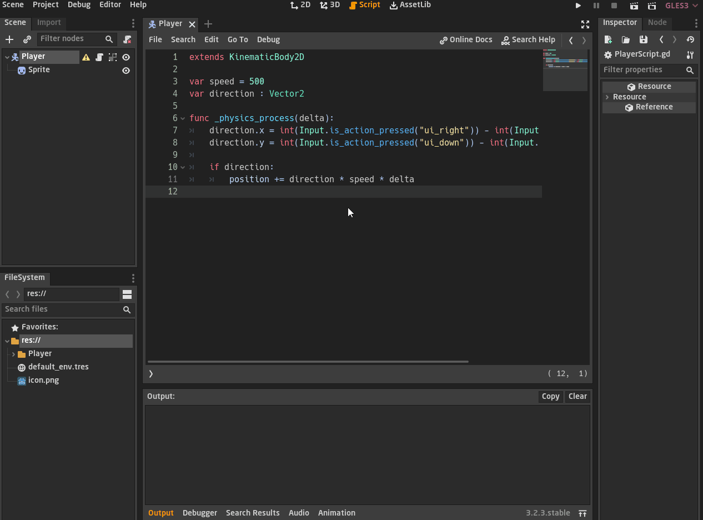

<div dir = rtl>

<div align = "center">

# السلام عليكم ورحمة الله وبركاته
## --{تحسين الحركة}--
## الدرس الحادي عشر - 11

</div>

في الدرس السابق كتبنا اوامر الحركة الاساسية في الجهات الاربعة  
وكان امر الحركة الى اليمين كهذا

<div dir = ltr>

```swift
var speed = 300

func _physics_process(delta):
    # Move Right
    if Input.is_action_pressed("ui_right"):
        position.x += speed * delta
```
</div>

## `هل يمكننا تحسينه ؟`

بالطبع يمكننا، لقد عرفنا ان `Input.is_action_pressed("ui_right")` دالة ترجع لنا قيمة `boolean` تكون `true` اذا  ضغط المستخدم على زر السهم الايمن في لوحة المفاتيح و`false` ان لم يضغط، حسنا مادام انها قيمة `boolean` فيمكننا تخزينها في متغير، شيء مثل هذا  

<div dir = ltr>

```swift
var speed = 300

func _physics_process(delta):
    var right := Input.is_action_pressed("ui_right")

    # Move Right
    if right:
        position.x += speed * delta
```
</div>

خزنا القيمة في متغير يدعى `right` ثم استخدمناهُ في الشرط، المتغير اصبح يصف وظيفته  
قد تظن ان هذا الامر تافه في بادئ الأمر لكن دعنا نرى الاوامر مع باقي الاتجاهات

<div dir = ltr>

```swift
var speed = 300

func _physics_process(delta):
    # Define the input
    var right := Input.is_action_pressed("ui_right")
    var left := Input.is_action_pressed("ui_left")
    var up := Input.is_action_pressed("ui_up")
    var down := Input.is_action_pressed("ui_down")

    # Movement
    if right:
        position.x += speed * delta

    if left:
        position.x -= speed * delta
    
    if up:
        position.y -= speed * delta

    if down:
        position.y += speed * delta
```
</div>

أترى كيف اصبح الأمر منظم اكثر بتعريفنا للمتغيرات في البداية ثم استخدامها، وكل متغير يصف وظيفته  
اصبحت اوامر الحركة يسهل قراءتها وتعديلها ومنظمة بشكل افضل، هذا سيحدث فارقا في المشاريع الكبيرة لذا اجعل عملك منظم من البداية بشكل دائم

يمكننا ان نجعل الحركة افضل من هذا، دعونا نرى المتغيرات التى تحدد الاتجاهات
<div dir = ltr>

```swift
    var right := Input.is_action_pressed("ui_right")
    var left := Input.is_action_pressed("ui_left")
    var up := Input.is_action_pressed("ui_up")
    var down := Input.is_action_pressed("ui_down")
```
</div>

حسنا نحن نعرف ان الاتجاه الى اليمين تكون قيمة ال `x` موجبة واليسار تكون قيمة ال `x` سالب  
الان قيمة كل متغير ستكون `true` اذا تم ضغط على الزر الذي يشير اليه و `false` اذا لم يضغط  
### `اذا ماذا سيحدث اذا طرحنا اليسار من اليمين ؟`  

<div dir = ltr>

```swift
    var right := Input.is_action_pressed("ui_right")
    var left := Input.is_action_pressed("ui_left")
    
    var directionX := int(right) - int(left)
```
</div>

حسنا هنا اذا تحرك اللاعب الى اليمين فقط، ستكون قيمة ال `right` ب `true` و قيمة ال `left`  ب `false` فهكذا عملية الطرح ستكون هكذا  
 `int(true) - int(false)`  
لكن هنا لا يمكننا عمل معادلات كالضرب والجمع والطرح على انواع `boolean` فيجب تحويلها الى `int` ثم نقوم بعملية الطرح 
  
  عند التحويل نضع القيمة داخل `int(value)` هكذا قيمة ال `value` ستتحول الى `int` مهما كانت فستكون    
  `int(true) = 1` و `int(false) = 0`  
  <div dir = ltr>

```swift
    var directionX := int(right) - int(left)
    # directionX = 1 - 0 is 1
```
</div>

بالتالي اذا تحرك اللاعب نحو اليمين ستكون قيمة `directionX` تساوي `1`، واذا تحرك نحو اليسار ؟ ستكون `1-`

<div dir = ltr>

```swift
    var directionX := int(right) - int(left)
    # directionX = 0 - 1 is -1
```
</div>
 
بالتالي اصبح لدينا متغير قيمتة تكون ب `1` حين يتحرك اللاعب لليمين و`1-` حين يتحرك لليسار 
 وإذا لم يضغط على اي اتجاه ستكون قيمته ب `0`  

دعونا نرى كيف سيكون أمر الحركة الأن  
قبل هذا، انوه اننا سنختصر الأمر الى هذا 
<div dir = ltr>

```swift    
    var directionX := int(Input.is_action_pressed("ui_right")) - int(Input.is_action_pressed("ui_left"))
```
</div>

بدلًا من هذا  

<div dir = ltr>

```swift    
    var right := Input.is_action_pressed("ui_right")
    var left := Input.is_action_pressed("ui_left")
    
    var directionX := int(right) - int(left)
```
</div>
لا فرق كبير بين الأمران، فقط وفرنا متغيرين  

حسنا الان سنكتب كيف سيكون أمر الحركة في اتجاه اليمين واليسار الان

<div dir = ltr>

```swift    
    var directionX := int(Input.is_action_pressed("ui_right")) - int(Input.is_action_pressed("ui_left"))

    if directionX:
        position.x += directionX * speed * delta
```
</div>

اصبح الان لدينا متغير واحد يحدد اتجاه الحركة في اليمين واليسار  
### `أنستطيع فعل نفس الشيء مع الحركة في الاتجاهين الاسفل والاعلى ؟`

بالطبع !

<div dir = ltr>

```swift    
    var directionY := int(Input.is_action_pressed("ui_down")) - int(Input.is_action_pressed("ui_up"))
    
    if directionY:
        position.y += directionY * speed * delta
```
</div>

اصبح لدينا متغير اخر وهو `directionY` يحدد الاتجاه لأعلى ولأسفل  
اذا كان قيمته `1` يكون الاتجاه لأسفل واذا كانت `1-` يكون الاتجاه لأعلى لان محور `y` معكوس في محرك غودوت

سيكون أوامر الحركة كالأتي
<div dir = ltr>

```swift
    var directionX := int(Input.is_action_pressed("ui_right")) - int(Input.is_action_pressed("ui_left"))
    var directionY := int(Input.is_action_pressed("ui_down")) - int(Input.is_action_pressed("ui_up"))
    
    if directionX:
        position.x += directionX * speed * delta

    if directionY:
        position.y += directionY * speed * delta
```
</div>

حسنا انظر الأن لدينا متغيرين الاول يمثل اتجاه الحركة في محور ال `x` والمتغير التاني يحدد اتجاه الحركة في محور `y`  
ماذا لو دمجنا هذين رالمتغيرين في متغير واحدة يحدد اتجاه الحركة ؟

نستطيع فعل هذا باستخدام نوع البيانات `Vector2`  
فنحن نعرف ان من خواصه انه يحتوي على متغيرين في داخله `x, y` نستطيع الوصول لهما والتعديل عليهما وتخزين القيم فيهما

<div dir = ltr>

```swift    
var speed = 500
var direction : Vector2

func _physics_process(delta):
    direction.x = int(Input.is_action_pressed("ui_right")) - int(Input.is_action_pressed("ui_left"))
    direction.y = int(Input.is_action_pressed("ui_down")) - int(Input.is_action_pressed("ui_up"))

    if direction:
        position += direction * speed * delta

```
</div>

لم يختلف الأمر كثيرة، حتى ان الشرط اصبح واحد  
`if direction` اي طالما ان هناك حركة اي طالما ان قيمتي ال `x,y` في ال `direction` كلايهما لا يساويان `0` نفذ الأمر التالي  
 `position += direction * speed * delta`  


## `مشكلة في الزوايا`

دعونا نلقى نظرة على تحركات اللاعب بشكل عملي  



سنلاحظ مشكلة مزعجة وهي ان التحركات في الزواية تكون اسرع بكثير  
اي اذا تحرك اللاعب في اليمين مع الاسفل في نفس الوقت فان سرعته في اتجاه الجنوب الشرقي سيكون اسرع من الطبيعي

ولكي نفسر الامر انظر الى الصور التالية


<div align = "center">



</div>

هنا عندما يتحرك اللاعب في اتجاه اليمين فقط يكون محور `x` يساوي `1` ومحور `y` يساوي `0`  

`position += direction * speed * delta`   
الأمر هنا كانك تقول له <span dir = ltr> `(1, 0) * speed` </span>  
حيث ان <span dir = ltr> `(1, 0)` </span> هو متجه اتجاه ناحية اليمين طوله `1`  

وان حسبنا طوله عن طريق ايجاد الحد المطلق للمتجه  

<div dir = ltr>


</div>

سيعطينا `1` وهو ما سينضرب في ال سرعة `speed`   بالتالي السرعة لن تتغير اي ستظل كما هي، فقط الاتجاه من له عامل التاثر هنا وهذا ما نريده  

 وعندما يتحرك نحو الاسفل يصبح `y` يساوي `1` و `x` يساوي `0`  
سيكون نفس الأمر كانك تقول له <span dir = ltr> `(0, 1) * speed` </span>  
حيث ان <span dir = ltr> `(0, 1)` </span> هو متجه اتجاه ناحية الأسفل طوله `1`  

والحسبة ستعطينا نفس النتيجة  

<div dir = ltr>


</div>

## `أين المشكلة ؟`

اذا تحرك ناحية اليمين والاسفل في ان واحد يصبح `x` و`y` كلايهما يساويان `1` وهنا تظهر المشكلة  
بحيث ان المتجه <span dir = ltr> `(1, 1)` </span> ان حسبت قيمته او طوله  

<div dir = ltr>


</div>


سيعطيك 
 
اي `1.4142` وهكذا سيزيد سرعة اللاعب عن المتوقع وهكذا اصبح المتجه يؤثر على السرعة وهذا ما لا  نريده   
نحن نريده ان يحدد لنا الاتجاه فقط لذا يجب على طوله ان يكون مساويًا ل 1 لكي لا يؤثر على السرعة

`position += direction * speed * delta`   
هنا سيتجه اللاعب ناحية الجنوب الشرقي لكن السرعة `speed` ستزيد على الطبيعي لانها سيتم ضربها في `1.4142` وليس `1` 

<div align = "center">


</div>

## `Normalization Function`

حل هذه المشكلة سيكون بعمل بعض المعادلات الخاصة على المتجه ال `direction`  
نرجع لمثالنا الاول وهو اذا تحرك اللاعب ناحية اليمين والاسفل في ان واحد يصبح `direction` يساوي <span dir = ltr> `(1, 1)` </span>  
وهذا ما يجعل طوله اي الوتر يكون `1.4142` كما وضحنا 

اذا نحن نريد ان نغير قيم ال `x` و `y` الخاصة بال `direction` ليكون طوله `1`  
اي اننا سنحول متجه ال `direction` الى `متجه الوحدة` وهذا هو مفهوم ال `Normalization`  

## `كيف يتم تحويل المتجه الى متجه الوحدة`

ال `normalization` يحول اي متجه الى متجه وحدة، لكن كيف ؟  
عن طريق بعض المعادلات البسيطة، وهي كالأتي ان كان لديك متجه قيمه <span dir = ltr> `(3, 4)` </span> وان اردت ايجاد طوله سيكون `5`  

<div dir = ltr>


</div>

لنحوله الى متجه الوحدة كل ما علينا فعله هو ان نقسم قيم المتجه على طوله اي الوتر والوتر يقسم ايضا في نفسه  
فسوف نقسم قيم `x`و `y` و`الوتر` على `5`، كما هو موضح في الصورة التالية  
هكذا سيصبح طول المتجه اي الوتر يساوي `1` وقيم `x`و `y` سيتغيران ليتناسبا مع ناتج الوتر



في غودوت لدينا دالة متواجدة داخل خواص `Vector2` تدعى `normalized` تحول المتجه الى متجه الوحدة  
نحن نعرف ان المتغير `direction` من نوع `Vector2` فنستطيع استدعاء دالة ال `normalized`  

<span dir = ltr>

```swift
direction.normalized()
```   
</span>

لكن دالة `normalized` لا تعدل في قيم المتجه `direction` ذاتها  
لذا ان كتبته كهذا لن يحدث اي تغير في قيم `direction`  

لانها ترجع قيمة ال `direction` بعد ان تحول الى متجه الوحدة لذا يجب ان نستقبلها في نفسها بهذا الشكل  

<span dir = ltr>

```swift
direction = direction.normalized()
```   
</span>

لذا فإن حل مشكلة الحركة في الزوايا يكون باستعمالها 



وهذا توضيع عملي للأمر



ستلاحظ سرعة اللاعب في الزوايا تقل عند استخدامنا لدالى ال `normalized` 
ونحن نطبع طول المتجه قبل وبعد استخدام الدالة لتلاحظ الفرق  

هذا كان كل شيء في درس اليوم
سيكون هناك درس اخر لتحسين الحركة افضل من هذا وجعلها اكثر سلاسة ومرونة  
لكن سنغطي هذا في درس قريب لان درس اليوم كان طول الى حد ما  

الكود كاملًا  

<span dir = ltr>

```swift
extends KinematicBody2D

var speed = 500
var direction : Vector2

func _physics_process(delta):
    # define direction of movement
    direction.x = int(Input.is_action_pressed("ui_right")) - int(Input.is_action_pressed("ui_left"))
    direction.y = int(Input.is_action_pressed("ui_down")) - int(Input.is_action_pressed("ui_up"))
    
    # make a vector transform into the unit vector
    # i.e. its length equals 1
    direction = direction.normalized()
    
    # Movement
    if direction:
        position += direction * speed * delta
```   
</span>

</div>