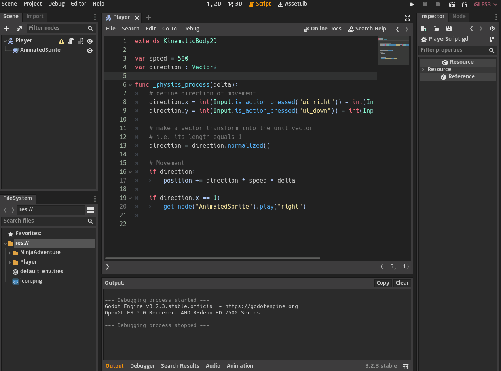

<div dir = rtl>

<div align = "center">

# السلام عليكم ورحمة الله وبركاته
## --{الأشكال المتحركة}--
## الدرس الثاني عشر - 12

</div>


في الدرس السابق تكلمنا عن تحسين اوامر الحركة الى حد ما  
درس اليوم سنتكلم عن كيفية اضافة اشكال للشخصيات او ما يعرف بالـ `sprite` وكيف وضع شكل متحرك لحركة الشخصية  

عليك ان تعلم `انك مبرمج وليس رسام`، اي انه ليس شرطًا عليك ان ترسم شخصياتك  
هذا الامر يكون `وظيفة الرسام` `Artist` هو من يرسم لك الشخصيات والاشكال وكل تلك الامور  
حسنا بما اننا لسنا رسامين او ليس لدينا رسامين في الفريق او ان الرسام تأخر في الرسم،  
فسوف نضطر الى تحميل حزمة رسومية جاهزة `Asset Pack`، الحزم او الـ `Asset Pack` هي حزم جاهزة  
يستخدمها المطورين لسد نقص ما لديهم او بشكل مؤقت ليختبر اللعبة الى حين انتهاء الرسام الخاص بالفريق من الرسم

# `تحميل الحزمة`
سنستعمل حزمة تدعى `Ninja Adventure` من تطوير شخصان يلقبان بـ  `Pixel-boy` و`AAA`  
رابط حقوق الملكية الخاصة بهذه الحزمة [من هنا](../../../Project/FirstGame/NinjaAdventure/README.md)  
ويمكنك تحميل الحزمة من هذا الرابط https://pixel-boy.itch.io/  


لن نقوم بإستخدام كل الحزمة، سنستخدم فقط ما نحتاجه لكل درس  
نحن حاليا نحتاج اشكال متحركة للشخصية الرئيسية خاصتنا  
وهذا ما اخترته ليكون الشخصية الرئيسية `GreenNinja`


سترى وجود العديد من الرسومات والتحركات لوضعيات مختلفة مثل الهجوم والقفز والتحرك والى اخره

## `عقدة الـ AnimatedSprite`

حسنًا، الان نحتاج لان نضع هذه الاشكال المتحركة الى شخصيتنا الرئيسية  
سنأتي على مشهد اللاعب ونحذف عقدة الـ `Sprite` لاننا سنستعمل عقدة جديدة وهي عقدة الـ `AnimatedSprite`  
وكما يوحي الاسم فهي العقدة المتخصصة في التعامل مع الاشكال المتحركة  


سنأتي على قائمة المراقبة الـ `inspected` ونأتي عند خيار الـ `Frames` ونختار `New SpriteFrames`  
هكذا نحن نقوم بعمل إطار عمل جديد لوضع الرسوم المتحركة المختلفة وهي النافذة الجديدة التى ظهرت في الأسفل

دعنا نلقي نظرة على شكل النافذة التى ظهرت لنا 


- `المربع الأحمر` : هنا المكان الذي نقسم فيه الحركات المختلفة مثل  
  الحركة الى اليمين واليسار او حتى حركة القفز وحركة الهجوم والى ما شابه  
- `المربع الأصفر` : هنا ستظهر لك الإطارات الخاصة بكل حركة  
- `المربع الاخضر` : هنا تستطيع ان تتحكم بسرعة كل حركة اي سرعة كام إطار في الثانية `FPS`  
  وخيار الـ `Loop` يمنحك الخيال ان كنت تريد للحركة ان تكرر نفسها ام لا  
- `المربع الأزرق` : تلك الايقونة سنستخدمها لجلب الصورة وتقسيمها واختيار الإطارات التى نحتاجها

دعونا نرى بعض تلك الأمور بشكل عملي 


لنراجع الخطوات قليلًا

- قمنا بتسمية اول حركة لنا وهي `right`
- قمنا بالضغط على الايقونة التى تشبه الشبكة
- تصفحنا المجلدات واختارنا الرسوم الخاصة بالحركة  
  واختارنا تلك الصورة  
  
- ستظهر لنا نافذة التقسيم بهذا الشكل  
  
  
  - `المربع الأزرق` : هنا نختار ابعاد التقسيم، اي تريد ان تقسمها الى `كم عمود ؟` و`كم صف ؟`  
  نحن هنا قلنا عدد الصفوف `4` والاعمدة `4`  
  `ملحوظة` : يختلف طريقة التقسيم باختلاف ابعاد الصورة، `هل الإطارات مرصوصة بابعاد متساوية ام لا ؟`  
  تلك الامور يجب على الرسام `ان يأخذ حذره منها`
  - `المربع الأصفر` : هنا يمكنك ان ترى كيف تم التقسيم وتختار ما تريده مثل ما رأيت  في الصورة العملية
- ستلاحظ في النهاية اننا وضعنا `4` حركات وهي الجهات الاربعة واعطيناهم اسم يرمز لهم

## `استعمال الرسوم المتحركة` 

قبل ان نبدأ، اذا قمت بتشغيل اللعبة ستلاحظ ان اللاعب صغير، لذا سنذهب لتكبيره عن طريق الـ `Scale`


### `ملحوظة` : في الدروس القادمة سنتعلم كيف نظبط أبعاد اللعبة والكاميرا لكي لا نغير حجم الشخصيات في كل مرة  

حسنا، المشهد الخاص بالشخصية الرئيسية يبدو حاليًا هكذا  
يتكون من العقدة الرئيسية وهي `KinematicBody2D`  التى اسميناها `Player` وايضًا به نص برمجي ملحق به  
ثم لديه ابن وحيد وهو عقدة الـ `AnimatedSprite` 


الأن كيف نستطيع من العقدة الرئيسية عقدة الـ `Player` الوصول لعقدة الـ `AnimatedSprite` ؟  

لدينا في لغة الـ `Gdscript` دالة تدعى <span dir = ltr > `get_node()` </span>  
وهي بكل بساطة تستقبل المسار الخاص بالعقدة الابن التى تريدها ثم ترجع لك `Object` من هذه العقدة

- تذكر في [درس الاصناف classes](../../Gdscript/[07]Classes/README.md) قلنا ان كل عقدة  صنف عبارة عن `built-in class` اي انها اصناف جاهزة  
  والكائن `object` هو متغير من هذا الصنف `class` يستطيع الوصول الى كل خواص والدوال التى يمتلكها الصنف

- بالتالي عندما قلنا ان دالة الـ `get_node` تستقبل مسار العقدة التى نريدها ثم ترجع لنا كائن `object`  
  فأننا عن طريق هذا الكائن نستطيع ان نصل الى جميع خواص ودوال العقدة التى نحددها  

بمعنى اننا نستطيع في داخل  النص البرمجي الملفق بالعقدة الرئيسية `Player` ان نصل للـ `AnimatedSprite` عن طريق الامر التالي  

<span dir = ltr>

```swift
get_node("AnimatedSprite")
```   
</span>

كهذا اصبح لدينا السيطرة الكاملة على عقدة الـ `AnimatedSprite`، حسنًا ماذا نفعل الان ؟  

نحتاج الى ان نعطي للاعب شكل متحرك عندما يتحرك نحو اي اتجاه  
بمعنى انه عندما يتحرك نحو اليمين يتم تشغيل إطارات الحركة نحو اليمين التى في الـ `AnimatedSprite`  

عقدة الـ `AnimatedSprite` لديها دالة تفعل هذا تدعى دالة `play` تعطيها اسم الحركة التى حددناها في عقدة الـ `AnimatedSprite`  

الأسماء التى حددناها سواء `down`, `left`, `right` او `up`  


الامر سيكون هكذا 

<span dir = ltr>

```swift
get_node("AnimatedSprite").play("right")
```   
</span>

كهذا سيشغل حركة الـ `right`، لكن نحن لم نقل له متى يفعل هذا  
نحن نريد ان يشغل حركة الـ `right` عندما يتحرك اللاعب نحو اليمين  

<span dir = ltr>

```swift
if direction.x == 1:
    get_node("AnimatedSprite").play("right")
```   
</span>

نحن قلنا في الدرس السابق انه عندما يكون `direction.x` يساوي `1` فان اللاعب هكذا يتحرك نحو اليمين وعندما يساوي `1-` فانه يتحرك نحو اليسار  

دعونا نرى تطبيقا عمليا لكل ما فات   


## `وقف الحركة`

الان لدينا مشكلة هنا، ستلاحظ انه برغم من توقف اللاعب عن الاتجاه نحو اليمين  
مازال حركة الشكل اللاعب  يتحرك نحو اليمين بمعنى انه مازال امر حركة الـ `right` الذي في عقدة الـ `AnimatedSprite` يعمل  
لانك ان كنت تتذكر فنحن عند خاصية الـ `loop` جعلناها `on` اي انه عندما يتم تشغيل حركة الشكل فانه سيكرر نفسه دائمًا  
لايقاف امر حركة الشكل فهناك دالة بداخل الـ `AnimatedSprite` تدعى `stop` وهي بكل بساطة توقف حركة الشكل الحالية  

<span dir = ltr>

```swift    
# Movement
  if direction:
    position += direction * speed * delta
    
  else: # stop animation movement
    get_node("AnimatedSprite").stop()

```   
</span>

اتينا عند اوامر الحركة وقلنا اذا لم يعد اللاعب يتحرك قم بإيقاف حركة الشكل <span dir = ltr> `get_node("AnimatedSprite").stop()` </span>  

مثل ما هو موضح هنا  


الأمر لم ينتهي الى هنا، نحن اوقفنا حركة الشكل لكنه قد يتوقف عند إطار غير مناسب  

أنظر الى هذه الصورة لتوضيح الامر


قد تتوقف الحركة عند الإطار `3` او `1` وهذا ليست وضعية مناسبة للتوقف  
لذا علينا ارجاع الشكل الى الإطار `0` ليعطي وضعية مناسبة  

لفعل هذا فإن عقدة الـ `AnimatedSprite` لديها متغير يدعى `frame` يسمح لنا بتغير الإطار

<span dir = ltr>

```swift    
# Movement
  if direction:
    position += direction * speed * delta
    
  else: # stop animation movement
    get_node("AnimatedSprite").stop()
    get_node("AnimatedSprite").frame = 0

```   
</span>

هكذا نوقف حركة الشكل ثم نرجع الإطار الى اول إطار وهو الـ `0`


## `رمز الـ $`

في الحقيقة ان دالة الـ `get_node` من كُثر ما يتم استخدامها ومن كِبر اهميتها تم عمل لها اختصار وهو رمز الـ `$`  

يتم اختصارها بهذا الشكل  

<span dir = ltr>

```swift
# this code statement
get_node("AnimatedSprite").stop()

# it become like this with $ sign
$AnimatedSprite.stop()
```   
</span>
 
لاحظ كيف تم اختصار الأمر برمز الـ `$`


## `شكل التحركات للجهات الأربعة`

حسنا لنجرب وضع شكل للحركة عندما يتحرك اللاعب نحو اليسار


الأن سنقوم بظبط سرعة اللاعب وسرعة الإطارات الخاصة بالاشكال المتحركة  
لنجعل سرعة اللاعب على سبيل المثال تساوي `250` وسرعة الإطارات تساوي `8`

انظر كيف ستصبح الحركة أسلس وافضل  
- `ملحوظة` : تستطيع تغير تلك القيم لتناسب لعبتك الخاصة  


أخيرًا سنقوم بوضع الجهات الاربعة كاملة  
ونظبط سرعة الإطارات الخاصة بالحركة نحو الاعلى والاسفل مثل ما فعلنا مع اليمين واليسار  


الأومر بشكل كامل  

<span dir = ltr>

```swift
extends KinematicBody2D

var speed = 250
var direction : Vector2

func _physics_process(delta):
    # define direction of movement
    direction.x = int(Input.is_action_pressed("ui_right")) - int(Input.is_action_pressed("ui_left"))
    direction.y = int(Input.is_action_pressed("ui_down")) - int(Input.is_action_pressed("ui_up"))
    
    # make a vector transform into the unit vector
    # i.e. its length equals 1
    direction = direction.normalized()
    
    # Movement
    if direction:
        position += direction * speed * delta
        
    else: # stop animation movement
        $AnimatedSprite.stop()
        $AnimatedSprite.frame = 0
    
    # animation movement for right/left
    if direction.x == 1:
        $AnimatedSprite.play("right")
    elif direction.x == -1:
        $AnimatedSprite.play("left")
    
    # animation movement for down/up
    if direction.y == 1:
        $AnimatedSprite.play("down")
    elif direction.y == -1:
        $AnimatedSprite.play("up")
```   
</span>

</div>