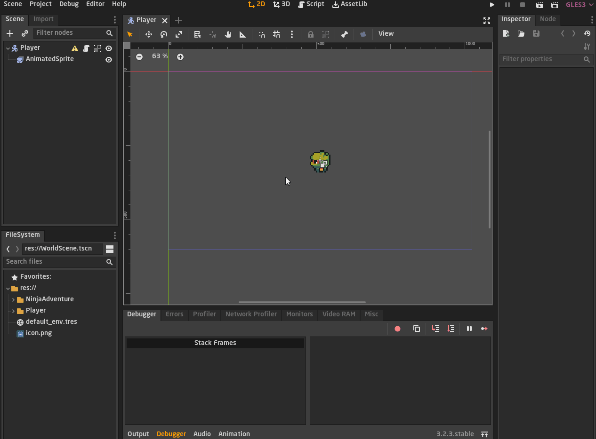
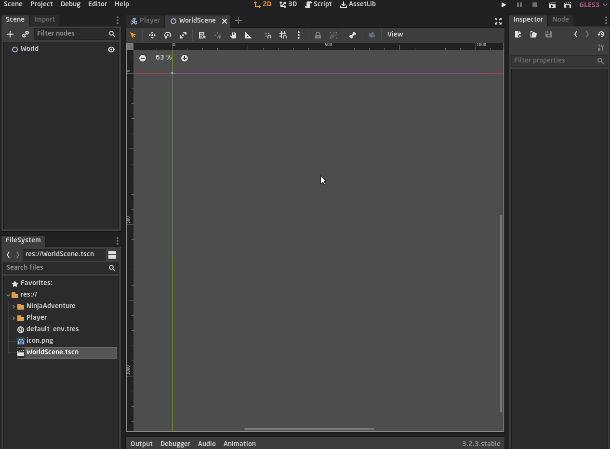
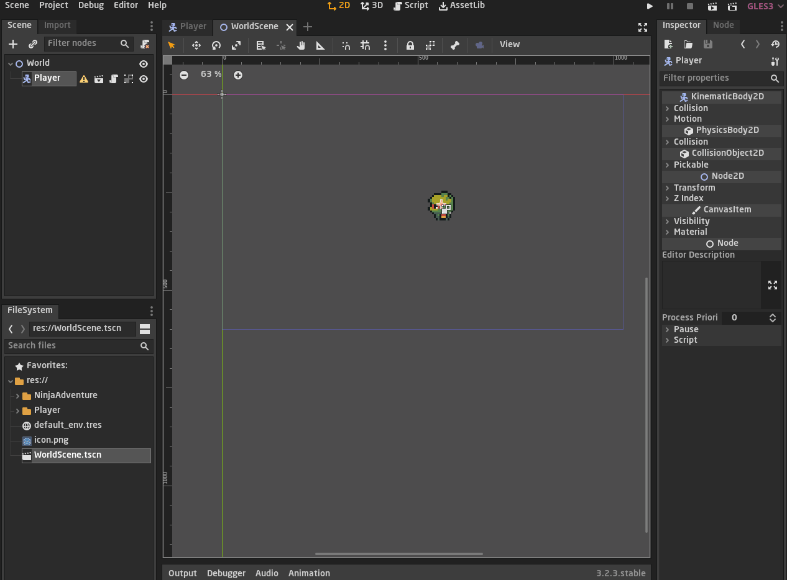
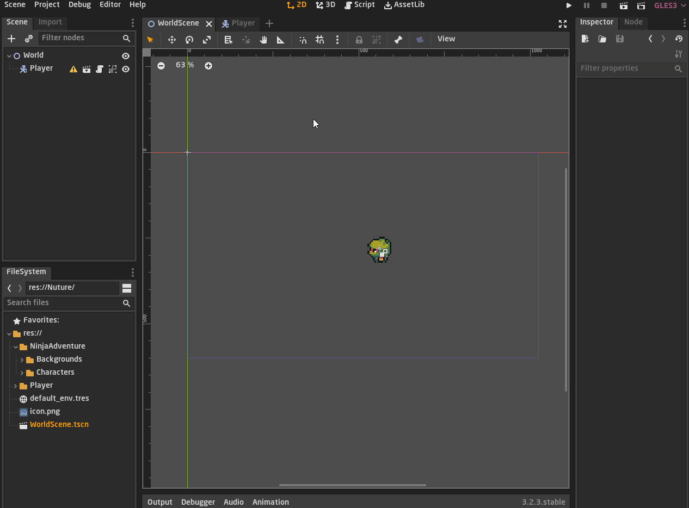
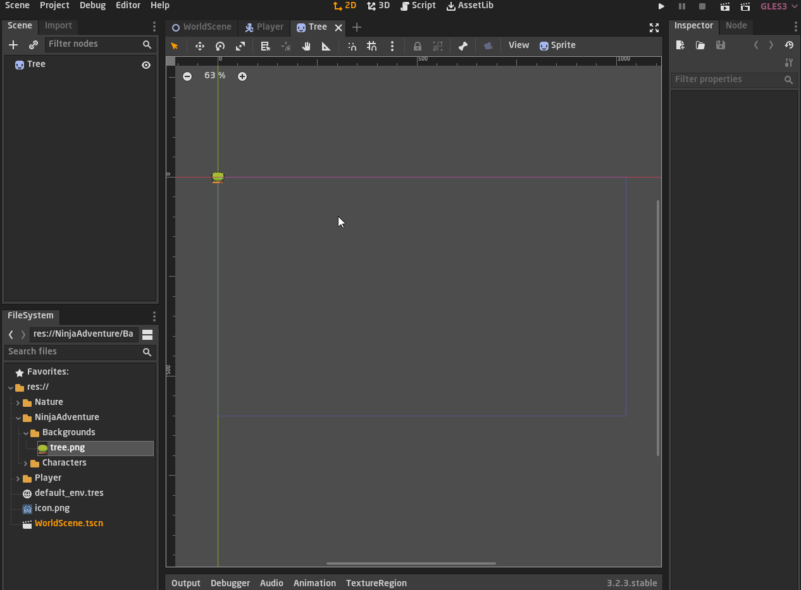
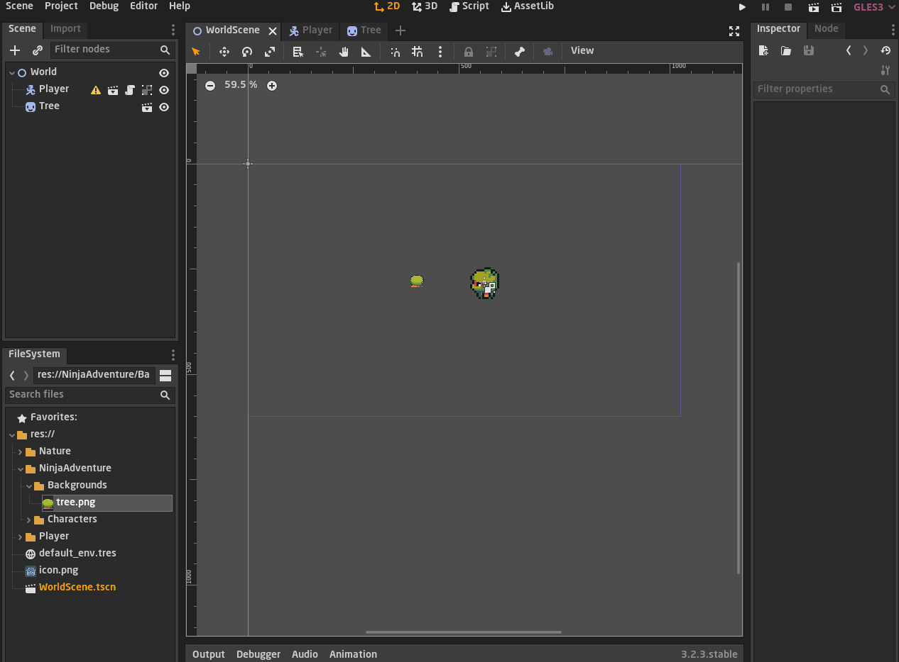
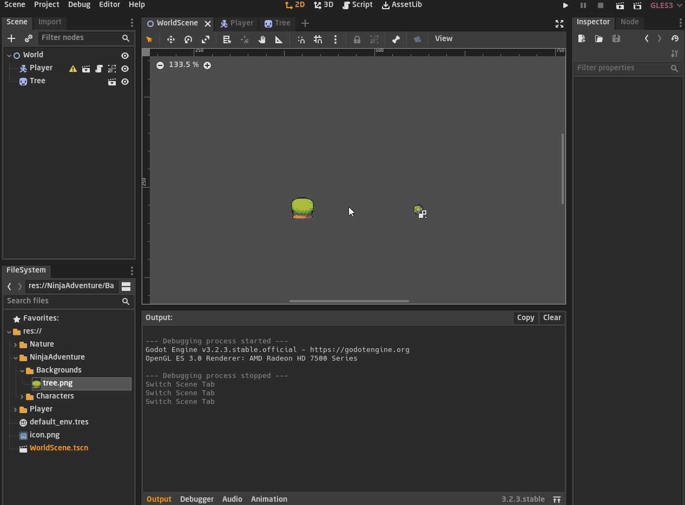
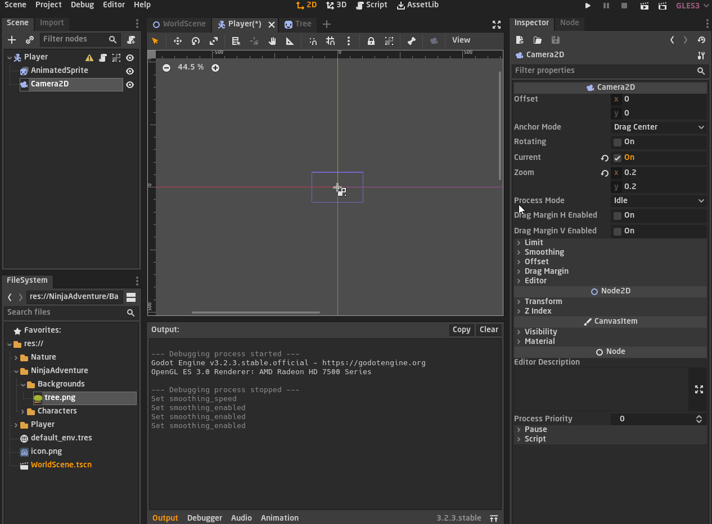

<div dir = rtl>

<div align = "center">

# السلام عليكم ورحمة الله وبركاته
## --{المشاهد والكاميرا}--
## الدرس الثالث عشر - 13

</div>

سنشرح في هذا الدرس إنشاء مشاهد مختلفة وربطهم ببعض   
وسنتعلم ايضًا التحكم بالكاميرا بإستخدام عقدة `Camera2D`

## `المشهد الرئيسي`

حاليا نحن نمتلك مشهد واحد وهو مشهد اللاعب   
ان اردنا وضع شجرة على سبيل المثال في عالم اللعبة، هل نضعها في مشهد اللاعب ؟  
بالطبع لا، بل نقوم بعمل مشهد خاص بهذه الشجرة، حسنا اذا قمنا بعمل مشهد للشجرة ومشهد للاعب  
سنحتاج لمشهد رئيسي يضم كل المشاهد التى لدينا سواء اللاعب اوالشجر او حتى الاعداء وكل تلك الامور  

لذا يجب ان ننشيء مشهد جديد يكون هو المشهد الاساسي والرئيسي لعالم اللعبة  
سنبدأ بانشاء المشهد ونعطيه اسم يناسبه مثل `World` العالم، مثل ما هو موضح في الصورة التالية 




## `ضم مشهد اللاعب بالمشهد الرئيسي `

نأتي في مشهد العالم ونختار ايقونة الربط التى تتواجد في قائمة المشهد كما هو موضح في الصورة التالية  
ثم نختار المشهد الذي نريد ضمه الى مشهد العالم، وهو اللاعب  
ستلاحظ انه تم ضم مشهد اللاعب، وهذا المشهد الخاص باللاعب` يكون نسخة من الاصل`  


ثم في مشهد اللاعب اعدنا ظبط موقع اللاعب وجعلناه في المركز  
لكي لا يكون موقع اللاعب غير معلوم او به ازاحة عن نقطة الاصل عندما يتم ضمه في اي مشهد اخر  
وبهذا تكون قد تجنبت مشاكل مستقبلية متعلقة بموقع اللاعب في اي مشهد يتم ضمه فيه  

بعد ان تظبط موقعه في مشهد اللاعب تستطيع ان تعود الى مشهد العالم وتغير موقع اللاعب كما شئت  
لانها نسخة فالاصل لن يتأثر  



## `جعل العالم هو المشهد الافتراضي`  

ستلاحظ انه عند تشغيل اللعبة سيتم تشغيل مشهد اللاعب بشكل تلقائي  
لانه في بداية السلسلة كنا قد جعلنا مشهد اللاعب هو المشهد الافتراضي  

لذالك يجب ان نغيره ونجعل مشهد العالم هو المشهد الافتراضي عن طريق الخطوات الاتية  

<span dir = ltr>

```
Project => Project Settings => Application => Run => Main Scene
```   
</span>



## `مشهد اخر!`

لنحاول عمل مشهد اخر، وليكن عبارة عن شجرة واحدة  
ننشيء المشهد ونجعل العقدة الرئيسية هي عقدة الشكل `sprite`  
ثم نضع لها شكل الشجرة ونقوم بحفظ المشهد في مجلد `nature` كنوع من التنظيم  



الان لدينا ثلاث مشاهد اللاعب والشجرة والعالم  
سنقوم الان بضم مشهد الشجرة للمشهد الرئيسي خاصتنا

  

## `ضبط حجم اللاعب`

عندما انشأنا اللاعب كنا قد كبرنا حجمه `5` اضعاف  
دعنا الان نعيد ضبط حجمه الى وضعه الطبيعي  
ندخل الى مشهد اللاعب ونظبط الـ `Scale` الى `1`  

ستلاحظ ان سرعة اللاعب لم تعد تتوافق مع حجمه الصغير لذا علينا تقليل السرعة كذلك  



## `عقدة الكاميرا Camera2D Node`

الان اصبح كل شيء صغير ولا نستطيع ان ن=ى الاشياء جيدًا سواء اللاعب او الشجرة  
لذا عليها تكبير وتقريب الشاشة ناحية اللاعب  

لفعل هذا علينا ان نتحكم بالشاشة التى يراها المستخدم  
لذا علينا ان نتحكم بالشاشة او الكاميرا بشكل عام  

في غودوت لدينا عقدة تقوم بهذا تدعى `Camera2D` وهي كاميرا مخصصة للمشاهد ثنائية البعد  

سنقوم بارفاق عقدة الكاميرا في مشهد اللاعب `لاننا نريد للكاميرا ان تتبع اللاعب`   
بعد ان نرفقها سنرى في نافذة الخواص `inspector` الخاصة بالكاميرا خيارات متعددة  

سنفعل خيار الـ `Current` وهذا الخيار هو من يفعل الكاميرا ويجعلها تعمل  
ثم لدينا خيار مهم وهو `Zoom` وهو من يقوم بتغير مدى قرب وبعد الكاميرا  
ان اعطيته `قيم صغيرة` فهكذا انت` تقرب الكاميرا` ناحية اللاعب  
وان اعطيته `قيم كبيرة` فهكذا انت `تبعد الكاميرا` عن اللاعب  



## `سلاسة حركة الكاميرا`

لدينا في نافذة الخواص الخاصة بالكاميرا خيار اخر مهم وهو الـ `Smoothing`  
وهو من يتحكم بالسلاسة حركة الكاميرا في تتبع اللاعب  

ان شغلت وفعلت هذا الخيار ستبدأ الكاميرا في ان تصبح سلسة في حركتها  
وتستطيع ان تتحكم في سرعة تحرك الكاميرا عن طريق خيار الـ `Speed`  

تستطيع ان تشاهد الفرق والمقارنة بشكل عملي في الصورة التالية   



هنا ينتهي درس اليوم كان درس سريع وبسيط   
في الدرس القادم سنشرح التصادمات بين الاشياء  `Collision`

</div>