<div dir = rtl>

<div align = "center">

# السلام عليكم ورحمة الله وبركاته
## --{التصادم}--
## الدرس الرابع عشر - 14

</div>

سنتكلم في درس اليوم عن التصادم بين الاشياء مثل اللاعب مع محيطه  
فحاليا لدينا اللاعب وشجرة في نفس المشهد لكن لا يحصل بينهما تصادم  

مثل ما هو واضح في الصورة التالية  
ستلاحظ مرور اللاعب في الشجرة دون ان يحدث اي تصادم  
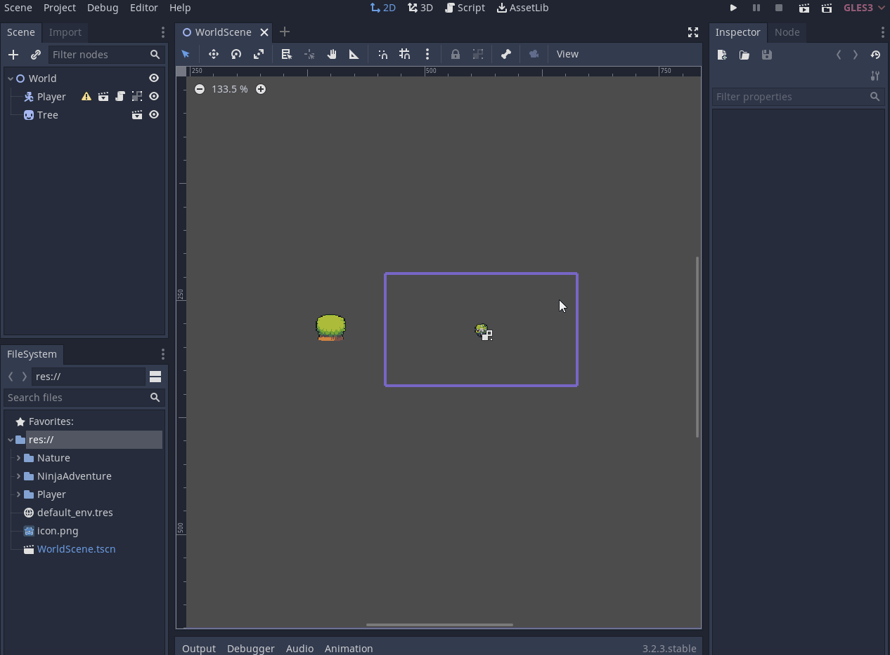

## `عقدة الـ CollisionShape`

قد تكون قد لاحظت في بداية السلسلة وجود اشارة تحذير بجانب عقدة اللاعب  


<div align = "center"> 

هذه الاشارة التحذيرية عندما تضغط عليها ستخرج لك هذه النافذة 

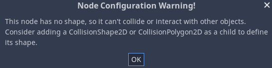
</div>

وهي تقول  
> ان عقدة اللاعب بما انه من النوع `KinematicBody2D`  
فيجب ان يحتوي على عقدة تصادُمية من النوع `CollisionShape2D` او `CollisionPolygon2D`  
لكي يستطيع التفاعل مع باقي الاشكال المحيطة به  

عقدة الـ `CollisionShape2D` تُحدد وتُعرف حدود شكل اللاعب الذي سيتصادم بها مع باقي الاشياء  
سنرى ذلك بوضوح بشكل عملي، الان نرفق عقدة التصادم في مشهد اللاعب  

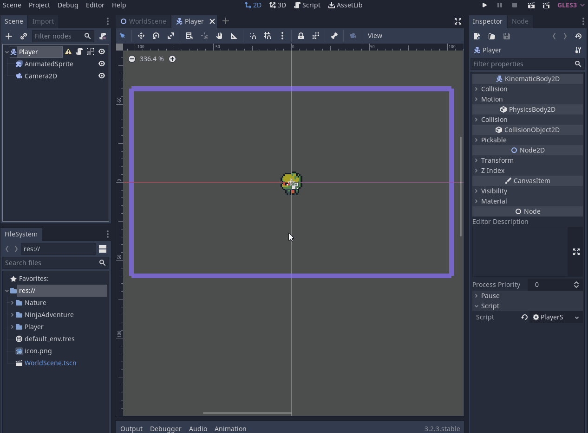

ستلاحظ وجود العلامة التحذيرية الصفراء مجددًا  

  


<div align = "center"> 

والرسالة التحذيرية تكون كالأتي

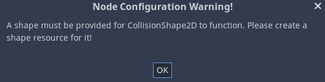  
</div>

وهي تقول  
> انك يجب ان تحدد شكل حدود التصادم لعقدة الـ `CollisionShape2D` لكي تعمل  

ولكي نحدد شكل حدود التصادم نضغط على العقدة وعند نافذة الخواص `inspector` سنرى خيار `shape`  
وسنرى عدة اشكال هندسية مثل الكبسولة والدائرة والمربع وغيرها  
هذه هي اشكال متنوعة لحدود التصادم تستطيع ان تختار اي منها وتحدده ليكون مناسبًا للشخصية  

مثل ما هو موضح في الصورة التالية  

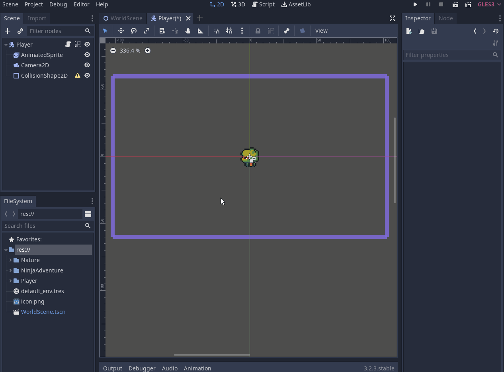

لقد اخترنا شكل الدائرة لكنك تستطيع ان تختار كما تشاء مثلا مربع او كبسولة او اي شيء  
الأمر عائد اليك وهي شكل شخصيتك

هكذا عقدة التصادم عندما تعطيها شكل فهي الان تعرف حدود شكل اللاعب  
وعندما يقترب اي شكل اخر من حدود تصادم اللاعب سيحدث التصادم  

الان عندما نشغل اللعبة واقتربنا من الشجرة  
`لن يحدث التصادم! لماذا ؟`  
لان الشجرة هي الاخرى يجب ان نرفق بها عقدة التصادم ونحدد لها شكلًا  

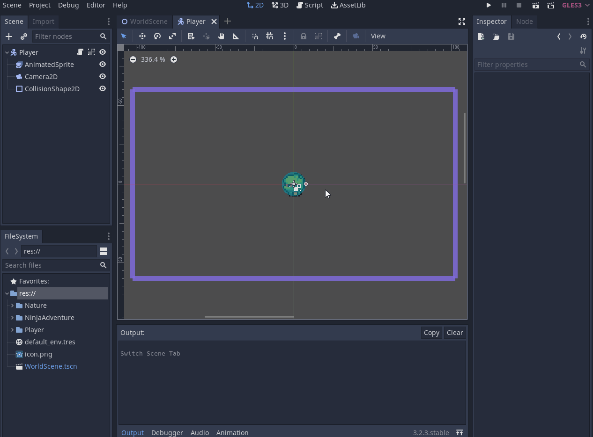

`لم يعمل التصادم بعد !؟`  
اليس بعد ان ارفقنا عقدة التصادم في اللاعب والشجرة يجب ان يعمل التصادم الان ؟

## `مشاكل متعلقة بالتصادم لكي يعمل`  

لماذا لم يعمل التصادم مع اننا ارفقنا عقدة التصادم في اللاعب والشجرة ؟

هناك امور يجب الانتباه لها، عندما ارفقنا عقدة التصادم في مشهد الشجرة  
ظهرت لنا الاشارة التحذيرية الصفراء  
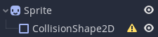

<div align = "center"> 

عند الضغط عليها ستعطينا هذه النافذة 

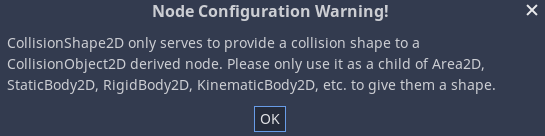  
</div>

وهي تقول بعض المعلومات الهامة عن عقدة التصادم  
> عقدة الـ `CollisionShape2D` تعمل فقط مع العُقد التى تدرج تحت عقدة الـ `CollisionObject2D`  
وهم الـ `Area2D`و `KinematicBody2D`و `RigidBody2D`و `StaticBody2D`  

<div align = "center"> 

هذه هي العقد التى تندرج تحت الـ `CollisionObject2D` 

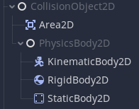
</div>

الان لنرجع لمشهد الشجرة  
  

ستلاحظ ان العقدة التى تندرج تحتها الـ `CollisionShape2D` هي عقدة الـ `Sprite`  
وليس من العقد الـ `CollisionObject2D` التى تحدثنا عنهم  

لذالك سنجعلها تندرج تحت عقدة `StaticBody2D` ولقد اخترنا عقدة `StaticBody2D` لانها العقدة التى تتعامل وتصف الاشياء الثابتة الجامدة  
وبما ان الشجرة ثابتة فلقد اخترناها  

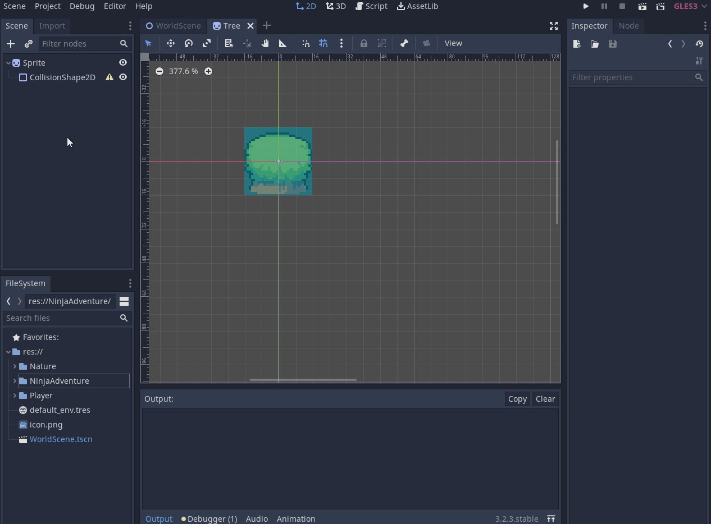

نبذة مختصرة عن عقد الـ `CollisionObject2D`

- `KinematicBody2D` عقدة خاصة بحركة اليدوية للاجسام
- `RigidBody2D` عقدة خاصة بالحركة الفيزيائية للاجسام
- `StaticBody2D`  عقدة خاصة للاجسام الثابتة


## `دالة move_and_collide وmove_and_slide`

الان بعد ان ظبطنا وارفقنا شكل لحدود التصادم لكلا من اللاعب والشجرة  

يجب ان تعرف ان عقدة التصادم تلك تحدد لنا فقط ابعاد وحدود التصادم  
ولا تقوم بعمل تصادم بشكل مباشر اي لا توقف الحركة عند حدوث تصادم  

بمعنى ان اللاعب لن يتوقف عندما يتصدم بالشجرة او باي شيء لديه عقدة تصادم    

لجعله يتوقف عند التصادم فنحن لدينا دالة تقوم بهذا، وهي دالة الـ `move_and_collide`  
تلك الدالة في الحقيقة تفعل شيئان اثنين، الشيء الاول تستقبل متجه حركة وتجمعه على الـ `position`  
والشيء الثاني انها تقوم بوقف حركة اللاعب عندما يتصدم باي شيء يحتوي على عقدة تصادُمية  

تتذكر امر الحركة ؟

<div dir = ltr>

```swift
# Movement
if direction:
    position += direction * speed * delta	
```
</div>

كل ما سنقوم به هو كالأتي   

<div dir = ltr>

```swift
# Movement
if direction:
    # handle the movement of the player and the collision with objects
    move_and_collide(direction * speed * delta)
```
</div>

كما قلنا الان ستستقبل دالة الـ `move_and_collide` متجه الحركة الذي في حالتنا هو هذه المتغيرات مجتمعة `direction * speed * delta ` 

ثم تجمعها على `position` كما كنا نفعل في الامر السابق  
الفرق انها تقوم `بوقف حركة اللاعب` عندما يتصدم باي شيء يحتوي على عقدة التصادم  

دعونا نرى النتيجة الان

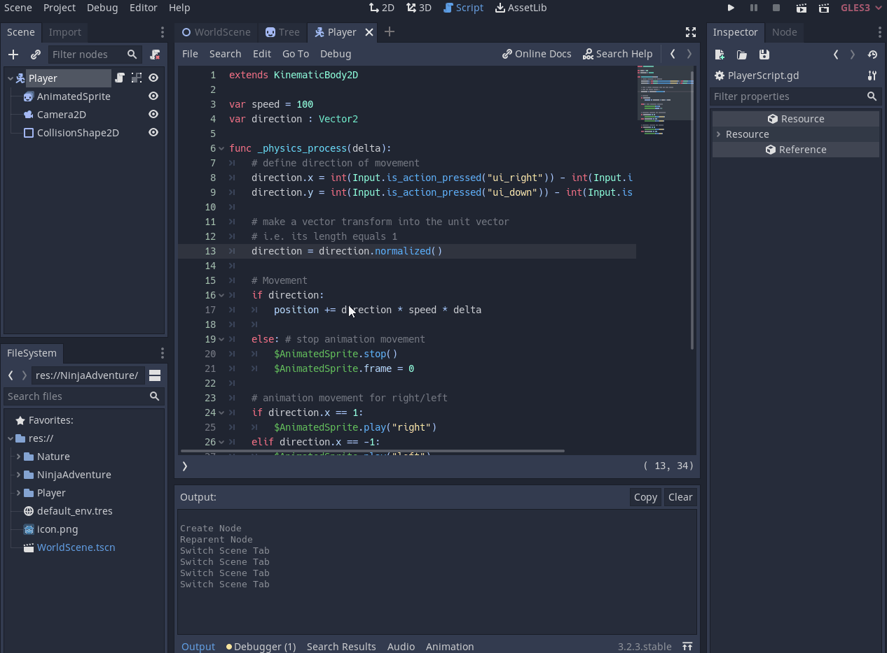

هناك شيء سيفيدنا في امور التصادم  
وهو اظهر شكل حدود التصادم اثناء تشغيل اللعبة  

لإظهارها نقوم بهذه الخطوات  

<span dir = ltr>

```
Debug => Visible Collision Shapes
```   
</span>

كما ترى في الصورة التالية

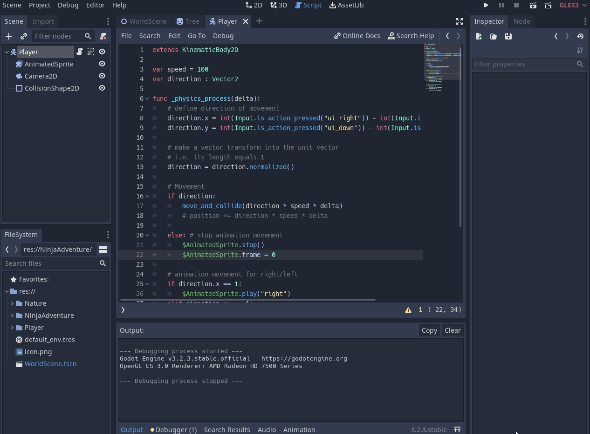

هذا الخيار يفيدنا كثيرًا اثناء تطوير اللعبة، تستطي ان ترى حدود التصادم لاي شيء  


## `move_and_collide vs. move_and_slide`

دعونا نتعرف اكثر عن هذاين الدالتين اكثر  
نحن الان نعرف دالة الـ `move_and_collide`  
حتى ان ذهبت الى الـ `docs` الخاص بهذه الدالة سترى في الوصف مكتوب  

<span dir = ltr>

> Moves the body along the vector rel_vec. The body will stop if it collides

</span>

وهو نفس الذي قلناه انها تحرك اللاعب عن طريق استقبال متجه الحركة وتوقف الحركة عن حدوث تصادم  

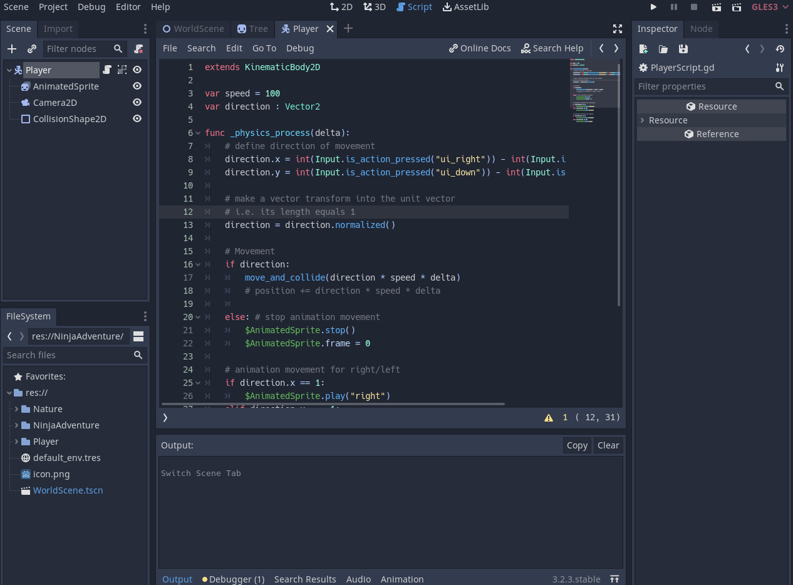

اما دالة `move_and_slide` تفعل نفس الشيء لكن بدلًا من ايقاف اللاعب بشكل مباشر، تقوم بجعله يتزحلق  
او يحاول ان تستدير حوله  

حتى ان ذهبت الى الـ `docs` الخاص بهذه الدالة سترى ان ذلك مكتوب في الوصف

<span dir = ltr>

> Moves the body along a vector. If the body collides with another, it will slide along the other body rather than stop immediatel

</span>

وهناك شيءٌ اخر وهو انها لا تحتاج الى ان ترسل لها `delta`  
لانها تستقبل متجه الحركة وتضربه هي بنفسها في `delta`  

وهذا مكتوب في الـ `docs` الخاص بالدالة ايضًا  

<span dir = ltr>

> it uses the physics step's delta value automatically in calculations

</span>

فليكون الامر الحركة هكذا  

<div dir = ltr>

```swift
# Movement
if direction:
    # handle the movement of the player and the collision with objects
    move_and_slide(direction * speed)
```
</div>

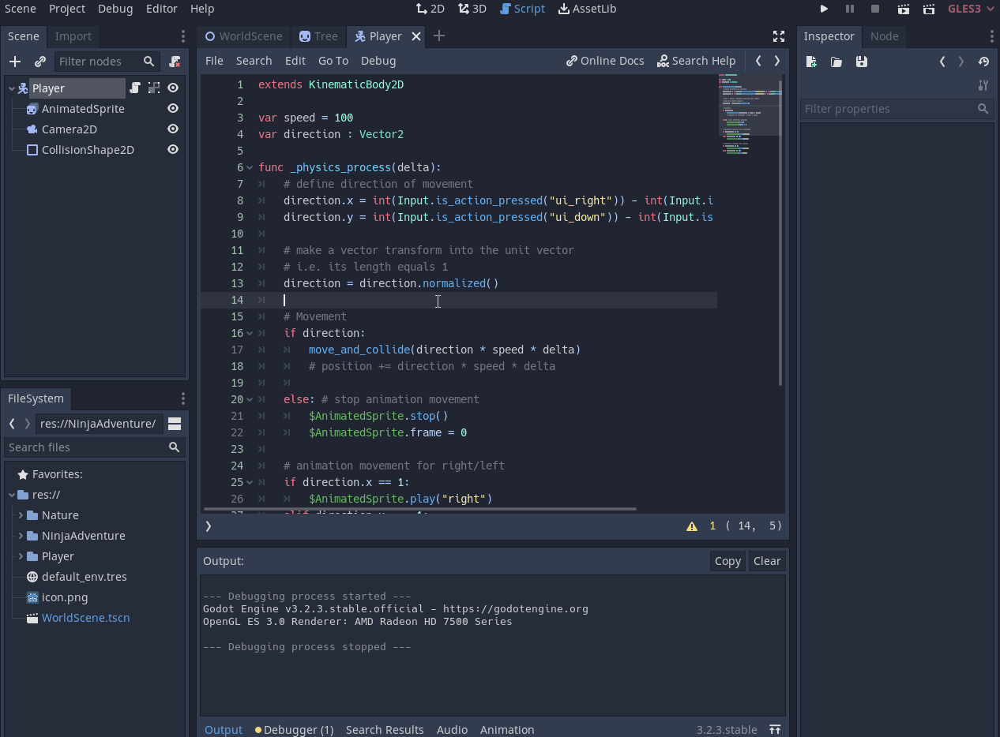

لتوضيح الفرق بينهما بشكل صحيح سنغير شكل حدود التصادم الخاص بالشجرة ونجعلها دائرية  

انظر الى الفرق عندما نستخدم كل دالة  

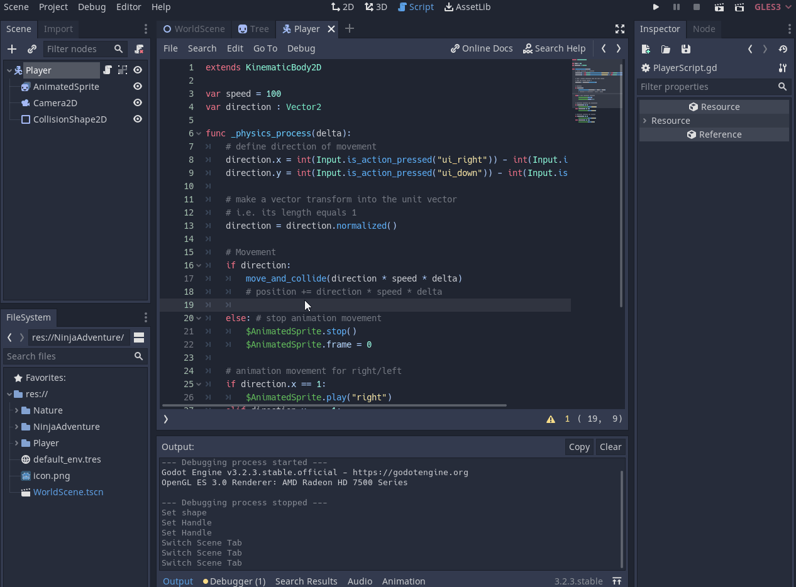

ستلاحظ ان في حالة استخدامنا لدالة `move_and_collide` فان الاعب يقف تمامًا عند حدوث التصادم  
لكن في حالة استخدامنا لدالة الـ `move_and_slide` ستلاحظ ان اللاعب لا يتوقف بل يدور ويستدير حول حدود التصادم الخاص بالشجرة  

هنا نكون قد انتهينا من درس اليوم  


</div>