

# السلام عليكم ورحمة الله وبركاته
## --{الأرضية}--
## الدرس الخامس عشر - 15

سنقوم في هذا الدرس بعمل الأرضية والبيئة المحيطة باللاعب  
وسنشرح عقدة الـ `TileMap` وهي من العقد المهمة في محرك غودوت  
وقد نحتاج الى دروس اخرى لتغطيتها  

- `ملحوظة`:  
 سيتم تحسين عقدة الـ `TileMap` ابتداءًا من الاصدار `4.0` من المحرك وسنغطي هذه التغيرات في درس منفصل بإذن الله  

## `الأرض العشبية`

نحن هنا فقط ارفقنا بعض الصور التى سنحتاجها في هذا الدرس، وهي صور لأرضية عشبية  

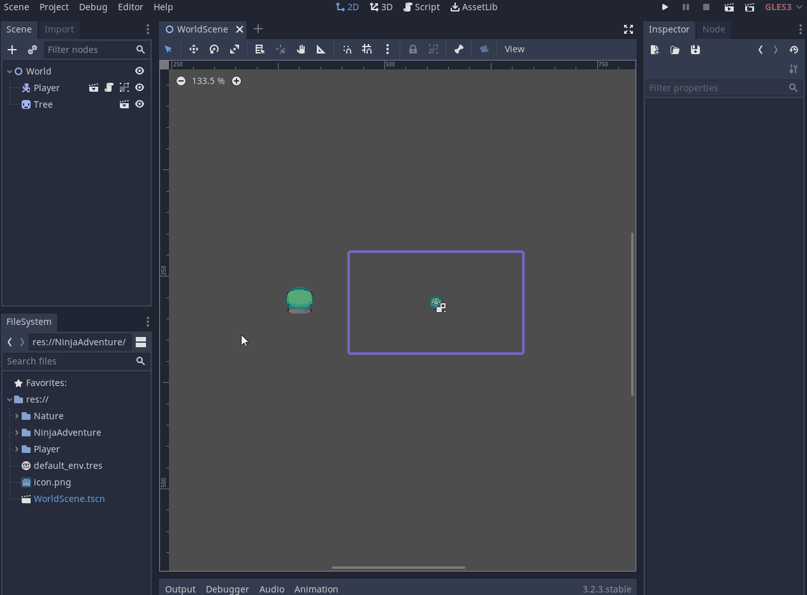

نقوم بعمل مشهد جديد، ونختار عقدة الشكل `sprite` وارفاق صورة العشب الاخضر بها  

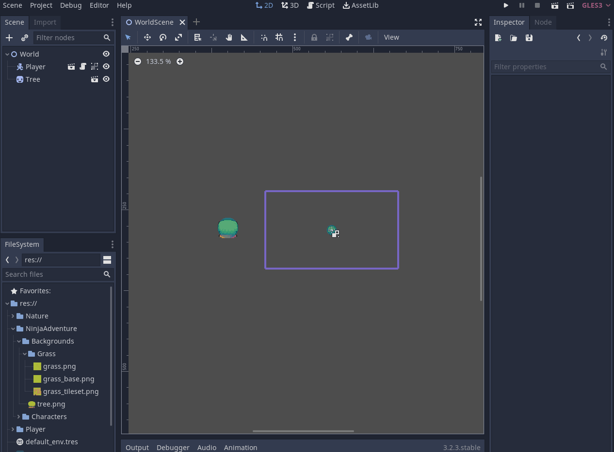

الان نضع المشهد الذي به الارض العشبية ضمن المشهد الرئيسي ونشغل اللعبة  

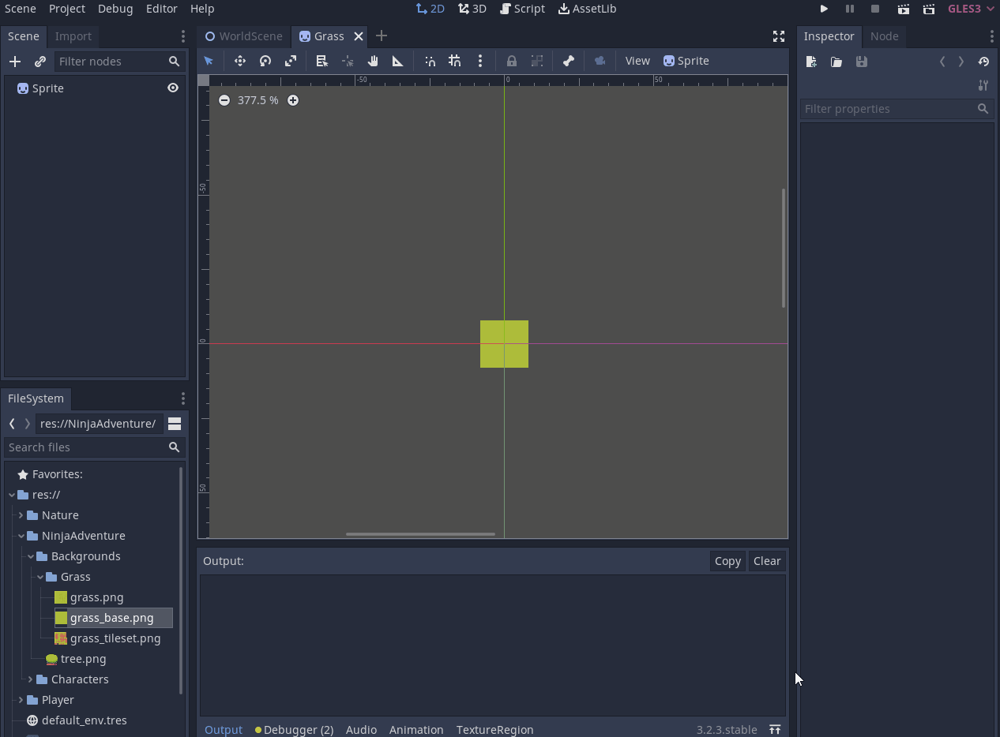

ستلاحظ طبقة اللاعب كانت تحت طبقة الارض العشبية  
ولإصلاح الامر علينا ان نجعل طبقة اللاعب اعلى من طبقة العشب  
عن طريق الذهاب الى مشهد اللاعب ثم في نافذة المراقبة  
هناك خيار يدعى `Z Index` وهو المسؤول عن ترتيب طبقات المشاهد  
كلما كان `الرقم اعلى كلما كانت طبقته اعلى من باقي المشاهد` فيظهر فوق باقي المشاهد  

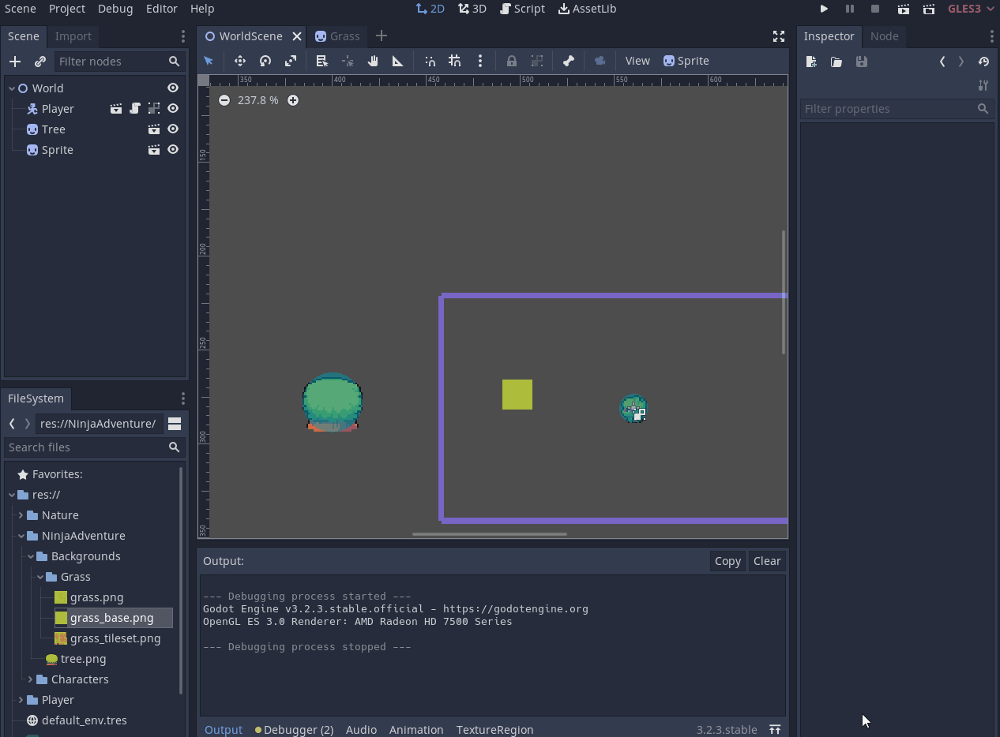

والان لنحاول مليء المشهد بالعديد من الاعشب الاخضر  
عن طريق تكرار مشهد الارض العشبية عدة مرات  

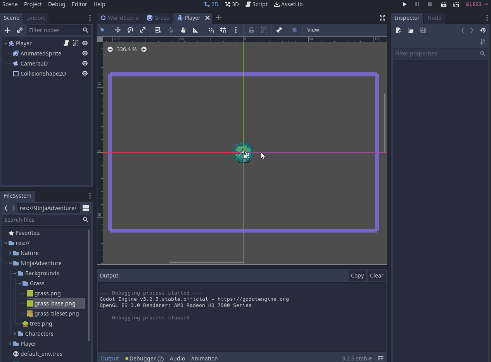

بالطبع هذا الامر سيأخذ وقتًا طويلا في هذه الحالة وسنطر لتكرار العديد من المشاهد  
وسيصبح المشهد الرئيسي مزدحم جدًا  

## `عقدة الـ TileMap`  

هنا يأتي دور عقدة الـ `TileMap` وهي عقدة تقوم بالعديد من الامور بخصوص البيئة المحيطة الخاصة بالعالم  
مثل البيوت وطرق واشجار وغيرها  

سنقوم اولا بحذف ما فعلناه والذهاب لمشهد العشب ونغير العقدة الرئيسية الى `TileMap`

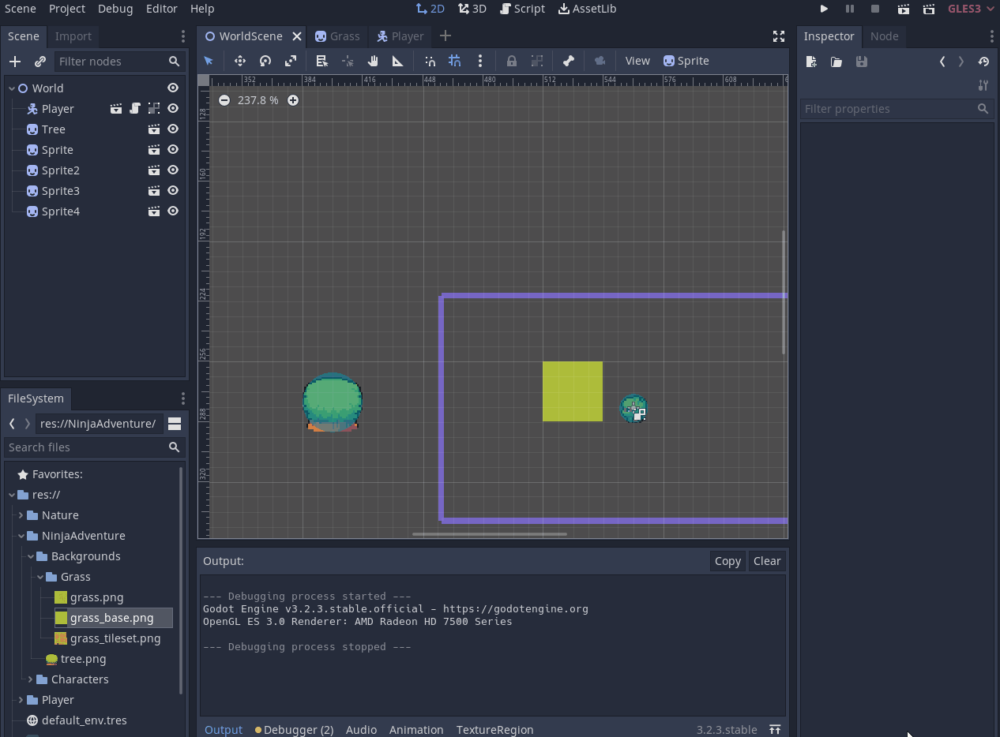

نقوم فقط بتعديل الاسماء الى اسماءها الجديدة وسنسمي العقدة بـ `TileSet` لانها ستضم مجموعة من المكونات مثل الاشجار والطرق والاعشاب والبيوت والعديد من الامور الاخرى  

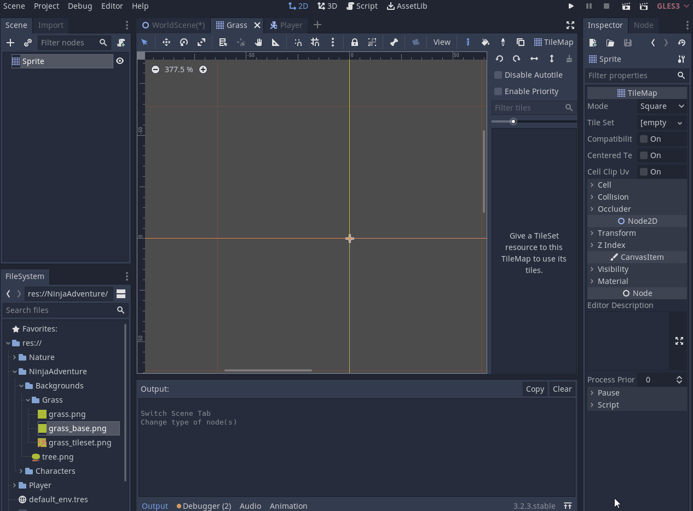

## `مكونات عقدة الـ TileMap`

لبدأ العمل على العقدة علينا الذهاب الى شريط المراقبة `inspector` ونختار خيار `Tile Set` ونختار `New TileSet`  
عند الضغط عليها ستظهر نافذة جديدة  

كما قلنا فإن هذه العقدة نرفق بداخلها مكونات البيئة مثل الاشجار والطرق والبيوت وغيرها من الامور  
ونتعامل مع هذه المكونات بطريقة سلسلة جدا مثل ما سنوضحه الان  

بعد ما نفتح النافذة الخاصة بالعقدة، نرفق بداخلها شكل العشب كما هو موضح في الصورة التالية  

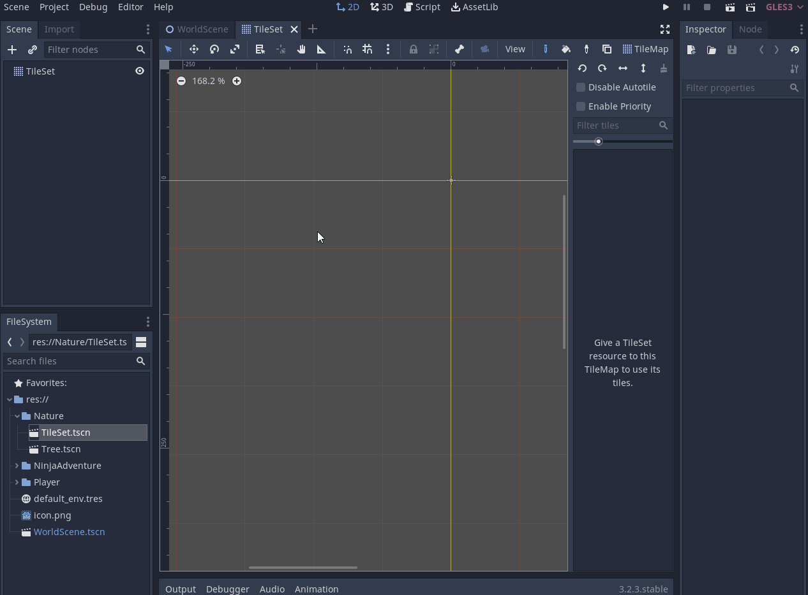

نحدد شكل العشب الذي ارفقناه،

سترى ثلاث خيارات اساسية  

- `New Single Tile`
  - وهو ما سنركز عليه اليوم، هو يسمح لك باقتطاع جزء واحد من الشكل (`جزء منه او الشكل كله`)
- `New Autotile`
  - سيتم شرحه بالتفصيل في الدرس القادم، يسمح لك بدمج وتركيب اشكال مختلفة باوضاع مختلفة في اطار واحد  
  - يستخدم في عمليات الملء التلقائية مثل الطرق والاراضي بأوضاعها المختلفة
  - مثال على الملء التلقائي `الذي سنشرحه في الدرس القادم بإذن الله`
    - 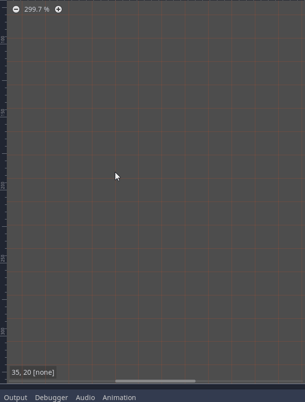
- `New Atlas`
  - سيتم شرحه في درس منفصل

هنا نحن سنختار `New Single Tile`  
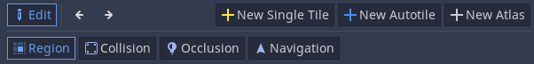

سيظهر لنا خيارات جديدة  

- `Region`
  - مسؤول عن اقتطاع الجزء الذي نريد قصه من الشكل، وسنرى كيف بشكل عملي في هذا الدرس
- `Collision`
  - مسؤول عن وضع وتحديد التصادم للشكل الذي اقتطعناه، سنرى تطبيق عملي في هذا الدرس
- `Occlusion`
  - مسؤول عن تحديد ابعاد الضوء والظلال للشكل، سنشرحها في درس منفصل
- `Navigation`
  - مسؤول عن وضع وتعريف المسار والاتجاهات، سنشرها في درس منفصل

نضغط على `Region` سيظهر لك في نافذة المراقبة الخاصة بالخواص خيار يدعى `Step` وظيفته تحديد ابعاد الجزء التى تريد اقتطاعه  

كما هو موضح في الصورة التالية صورة العشب كان مقاسها `16×16` وعندما جعلنا المقاس `8×8` اصبح نستطيع قصه بالربع  
لكننا ارجعناه الى `16×16`  

- `ملحوظة`: مقاسات القص والاقتطاع عائد اليك والى نوعية الشكل الذي تريد تحديده وقصه  

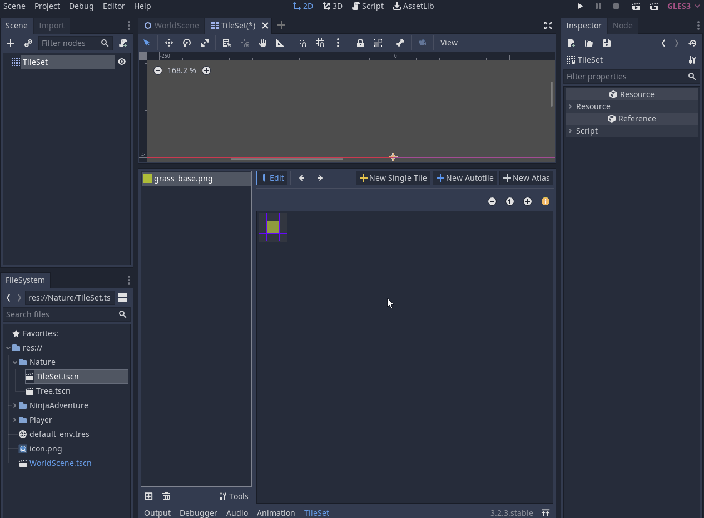

الان نرجع الى المشهد الرئيسي ونرفق مشهد عقدة الـ `TileSet`  
سترى انه ظهر لك شكل العشب في الواجه وستلحظ ان ابعاد تقسيم الشاشة اكبر من ابعاد العشب  
لذا في نافذة المراقبة سنذهب الى خيار يدعى `Cell` ونحدد ابعاد التقسيم الى `16×16` لتناسب مع ابعاد شكل العشب  

ثم نمسك العشب ونبدأ بوضعه في المشهد الرئيسي وعمل ارضية بكل سلاسة كما هو موضح في الصورة التالية  

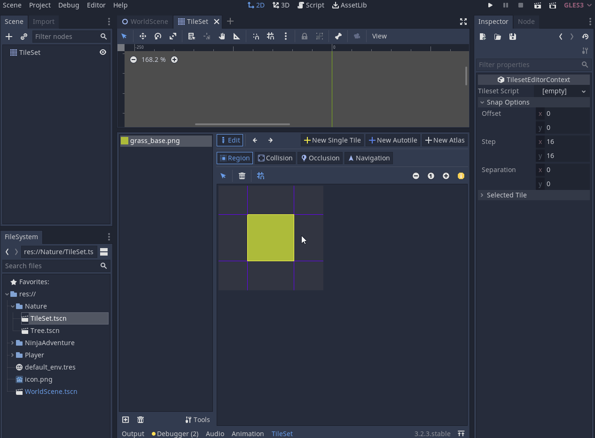

الان يمكننا عمل ارضية كاملة بسلاسة دون تكرار مشهد شكل العشب في هيكلة المشهد الرئيسي كما كنا نفعل سابقا  

الان ماذا عن الشجرة ؟ هل يمكننا ضمها داخل الـ `TileSet` مثل ما فعلنا مع العشب ؟  
بالطبع نعم، سنقوم بتكرار نفس الشيء مع الشجرة كما هو موضح في الصورة التالية  

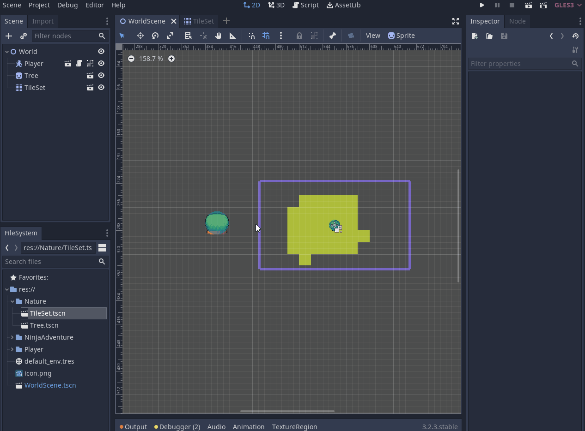

لاحظ اننا غيرنا مقاس التقسيم الى `32×32` لان صورة الشجرة حجمها مختلف عن العشب

الان علينا وضع شكل تصادم للشجرة، لانها الان مجرد صورة عابرة ليس بها اي تصادم وسيمر اللاعب من فوقها دون اي تصادم  
لوضع التصادم للشكل نختار خيار `Collision` ونحدد ابعاد وحدود التصادم  
ويمكننا تغير ابعاد التقسيم من الـ `step` الى `1×1` لوضع ابعاد التصادم بكل دقة  
كما هو موضح في الصورة التالية  

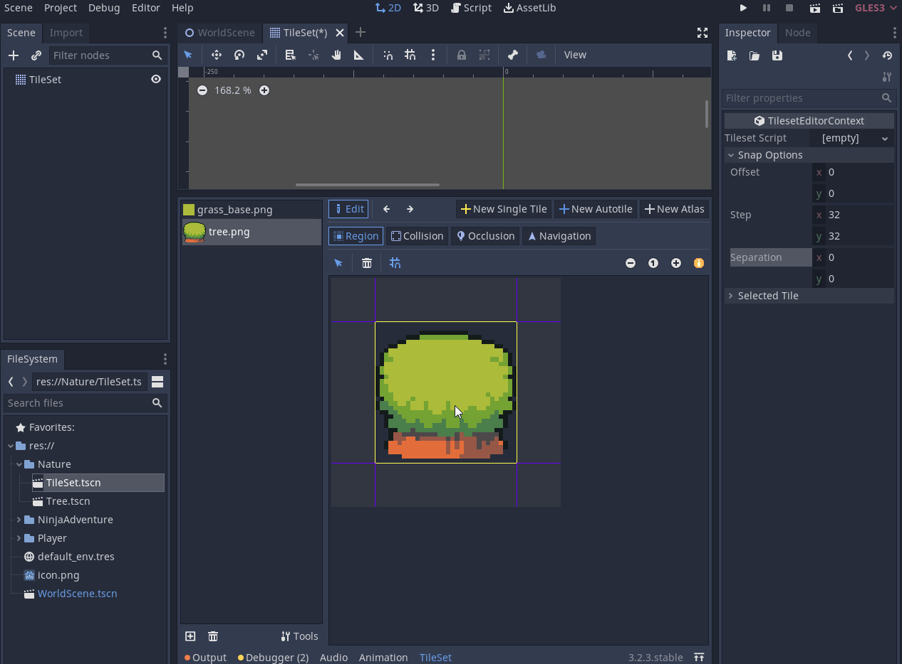

الان لنضع الشجر في المشهد الرئيسي ونرى كيف سيبدوا في المشهد بشكل عملي

وفي النهاية نقوم بمسح بمشهد الشجرة القدد لاننا لم نعد نحتاجه

## `بعض المشاكل وحلولها`

لدينا مشكلة تتعلق بإختلاف الاحجام، فالعشب مقاسه `16×16` والشجرة `32×32`  
وستلخظ ان في الشجرة مربع التحديد مقاسه `16×16` الذي غيرناه في خيار الـ `Cell` سابقًا  
فإذا حاولت وضع الشجرة فوق العشب فالعشب سيختفي وسيظهر خلفية شفافة خلف الشجرة  
يمكننا ان نحل المشكلة بطريقة ركيكة وهي رسم خلفية خضراء خلف الشجرة  
لكن هذا حل سيء جدا فإذا كانت الشجرة خلفها جدار صخري مثلا فسيظهر خلفية خضراء على الجدار  
وهذا مالا نريده، نريد ان تكون الخلفية شفافة لتأخد شكل ما خلفها سواء كان عشب او ماء او صخور  

الحل هو بما ان الشجرة اكبر من العشب، فيمكننا تغير موضع التحديد ونجعله في المنتصف من خلال خيار `Centered Texture`

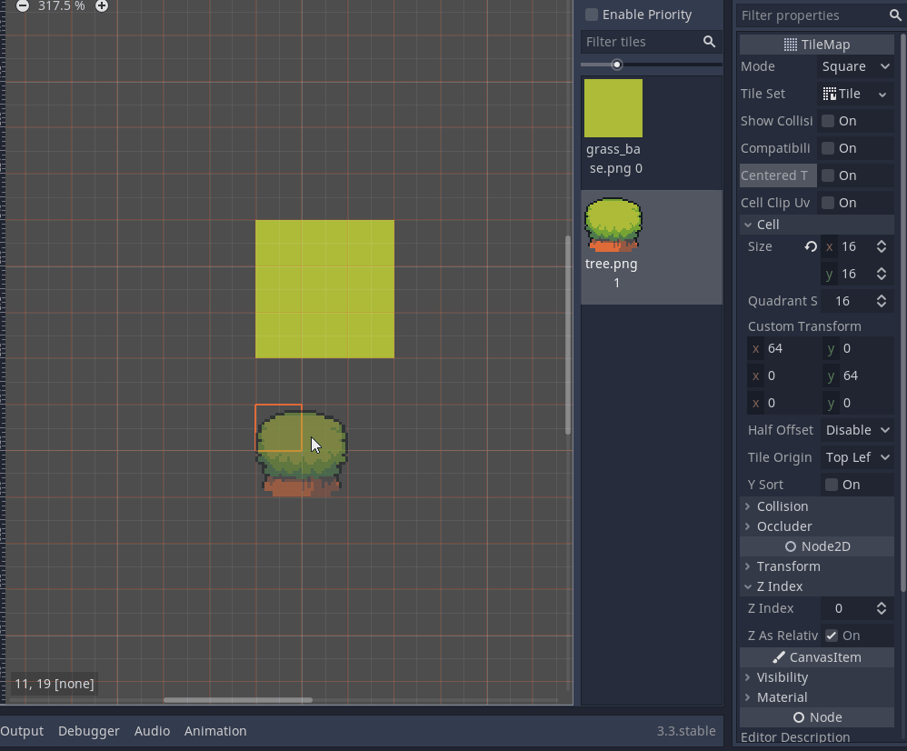

لدينا مشكلة جديدة وهي مشكلة الطبقات، ستلخظ ان احيانًا تكون طبقة العشب فوق الشجرة  
وهذا خطأ يجب على الشجرة ان تكون اعلى  
نحل هذه المشكلة عن طريق تغير الـ `Z Index` الخاص بالشجرة كما فعلنا مع اللاعب

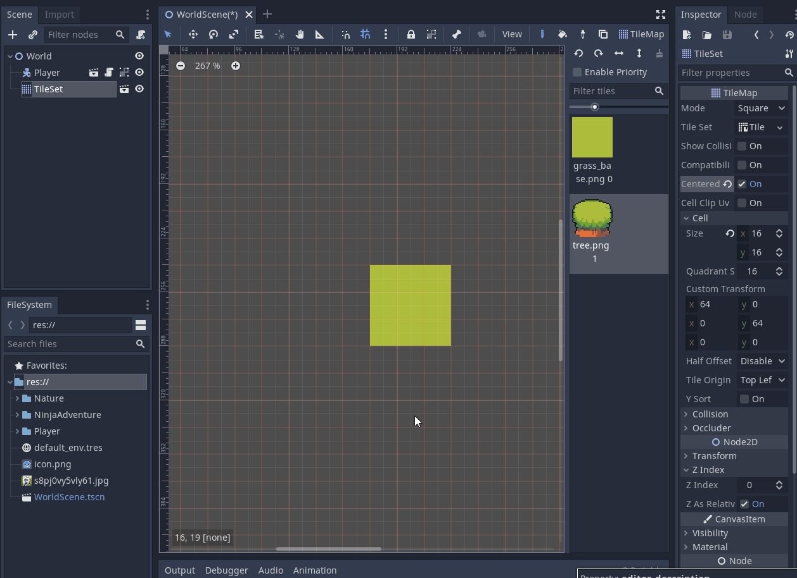

نذهب الى `Tile Set` ثم نحدد الشجرة ونذهب الى هيار `Z Index` ونجعله `1` اعلى من العشب  

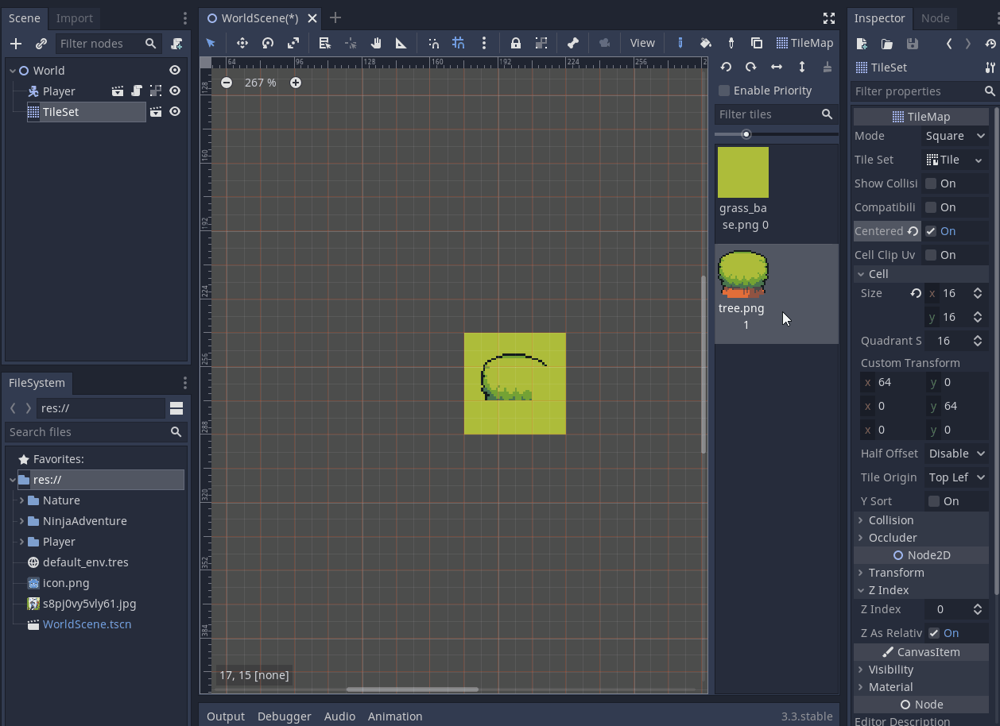

هنا ينتهي الدرس سنستكمل باقي الامور عن `TileMap` في الدروس القادمة  
الان يمكنك انشاء مرحلتك الخاصة كما تريد  

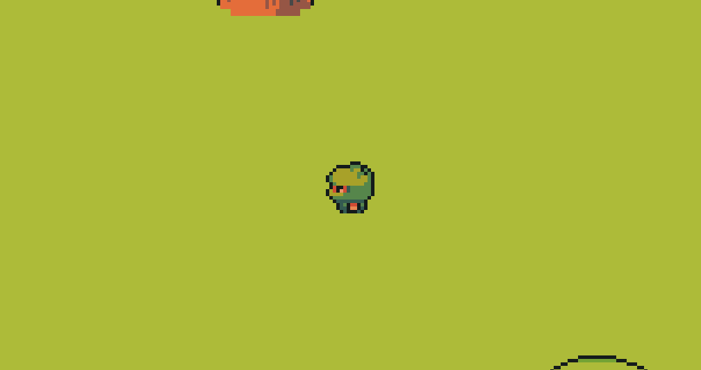

