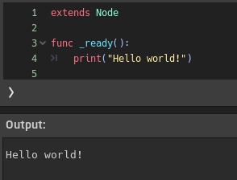
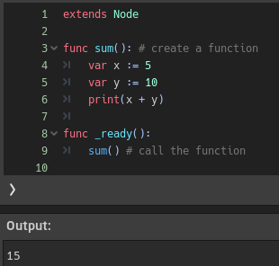
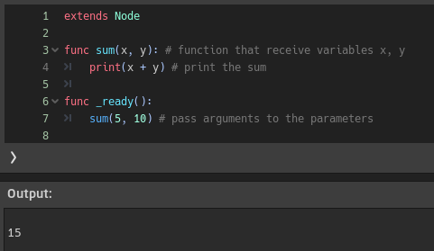
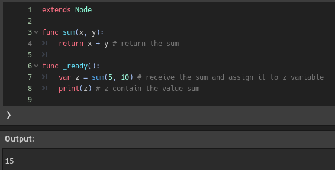
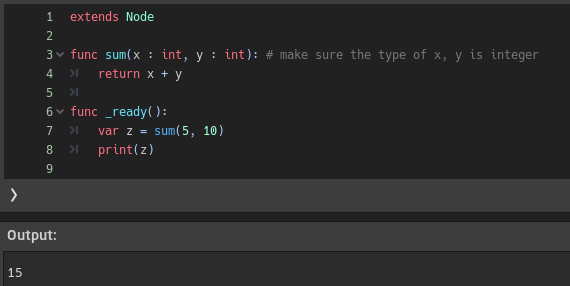
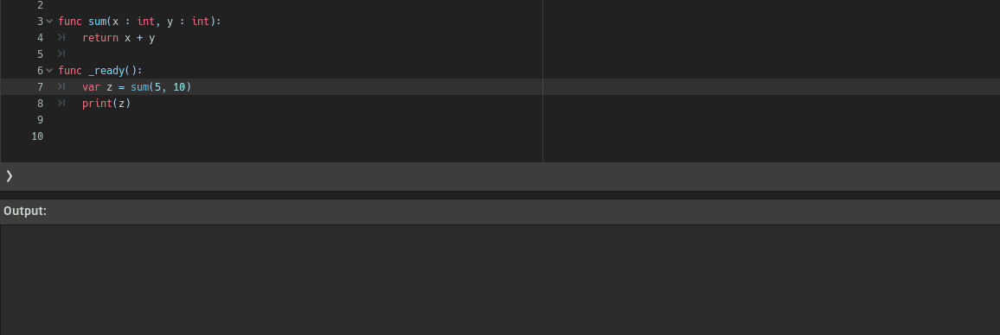
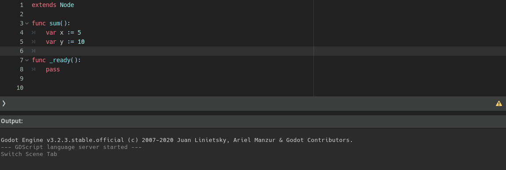

<div dir = rtl>

# السلام عليكم ورحمة الله وبركاته
## --{ الدوال }--
## الدرس الثالث - 03

اهلا بكم في درس جديد وهو الدوال  `function`   
حسنا يمكنك تخيل الدالة على انها جهاز تدخل له بعض المدخلات ثم يقوم ببعض العمليات عليها وفي النهاية يعطينا مخرجات التى تكون النتيجة المطلوبة  
دعونا نرى كيف تكتب

<div dir = ltr>

```swift
func Name():
  doSomething()
```
</div>

حسنا حين نعرف اي دالة نكتب `func` ليعرف البرنامج اننا ننشئ دالة ثم `اسم الدالة` اختار اي اسم تريده ثم `( )` سنعرف ماذا تفعل قريبًا

<div align = "center">



</div>

سنستعمل بعض الصور من داخل محرك غودوت فقط للتوضيع 

على اي حال الصورة في الاعلى توضح لنا ماهية شكل المكان الذي نكتب فيه الاكواد في المحرك  
نحن نبدأ كتابة الكود داخل <span dir = ltr> `func _ready():` </span>  وهي كما ترى على شكل دالة   
وهي الدالة الذي نكتب فيها أسطر الكود في غودوت وهي تتبع ايضًا `indentation`  
داخل الدالة كتبنا جملة الطباعة .. وعند تشغيل البرنامج سيتم طباعة الجملة مثل ما هو ظاهر في الصورة  
* دالة ال <span dir = ltr> `_ready()` </span> هي الدالة الذي يبدأ من خلالها البرنامج  تنفيذ الاكواد التى بداخلها عندما نشغل البرنامج  
  سنشرها بالتفصيل عندما ندخل في الدروس الخاصة بالمحرك غودوت  
  اي بعد انتهائنا من الاساسيات بإذن الله
### `حسنا مازلت لم افهم الدوال .. ماذا تفعل بالتحديد ؟`

حسنًا دعونا نرى المثال التالي

<div align = "center">


</div>

حسنا لقد انشأنا دالة خاصة بنا تدعى `sum` داخلها عرفنا متغيرين `x` و `y` واعطيتهما قيم ` 5 10` ثم نطبع مجموعهما `print(x + y)`  
الان هكذا عرفنا دالة و كتبنا داخلها بعض الاكواد .. حاليا الدالة معقلة ولن يتم تنفيذ اي كود داخلها  
### `متى يتم استدعاء تنفيذ اكواد الدالة التى انشأناها ؟`

<div align = "center">



</div>

يجب ان نستدعي الدالة الذي انشأناها داخل ال <span dir = ltr> `_ready()` </span> لانها الدالة الرئيسية التى يبدأ من خلالها البرنامج  
نستدعيها عن طريق كتابة اسم الدالة فقط هكذا سيتم طباعة `15` كما هو ظاهر في الصورة 

لكن هذه الدالة الذي تدعى `sum` ليست ديناميكية .. اي انها تجمع رقمين ثابتين و هما `10` `و5` والتيجة دائما ستكون `15`  
نريد ان `نرسل لها` رقمين وهي تجمعهما ... لاحظ اننا قلنا `نرسل` للدالة، حسنا كيف نرسل للدالة متغيرت لتجمعها ؟   
تعرف دالة الطباعة ؟


<div dir = ltr>

```swift
print("hi") # it a function that receive a string and print it
```
</div>

هي كما هو واضح عبار عن دالة `ننادي` عليها `ونرسل` لها ما نريد طباعتها `داخل ( )`   
معنى هذا ان تلك الاقواس سنستعملها لجعل  الدالة خاصتنا تستقبل متغيرات

<div align = "center">



</div>

لاحظ اننا قمنا بانشاء متغيرين `x وy `داخل اقواس الدالة `sum`  
هذا معناه ان دالتنا تلك تتقبل متغيرين ثم داخل الدالة نستدعى دالة الطباعة ونطبع مجموعهما  
في دالة ال `ready` قمنا باستدعاء دالة ال `sum` وارسلنا معها رقمين اي رقمين تريدهما  
وهكذا سيتم تنفيذ الاكواد داخل الدالة و يتم طباعة المجموع 

حسنا دعونا نسترجع تعريفنا للدالة وهي
> جهاز تدخل له بعض المدخلات ثم يقوم ببعض العمليات عليها وفي النهاية يعطينا مخرجات

حسنا لقد فهمنا كيف ندخل لها المدخلات وتجري العمليات عليها .. لكن ماذا يُقصد بـ يعطين مخرجات ؟  
هل الممر لا يقتصر على جمل الطباعة .. هل الدوال قد ترجع لنا الناتج لنستعمله ؟  
نعم الدوال قد ترجع لنا قيم نستعمله 

<div align = "center">



</div>

انظر ال تلك الصورة جيدا


<div dir = ltr>

```swift
func sum(x, y):
  return x + y
```
</div>

كلمة `return` تعني ان تلك الدالة سترجع لنا قيمة  
ثم تستطيع ان تستقبلتلك القيمة الراجعة من الدالة في متغير


<div dir = ltr>

```swift
  var z := sum(20, 10) # value of z will be 30
```
</div>

هكذا  .. فمثل ما قلنا ان الدوال كالاجهزة تستقبل مدخلات ثم تجري عليها عمليات ثم تخرج لنا بناتج العملية  
فدالة ال `sum` استقبلت رقمين ثم اجرت عليهما بعض  العمليات ثم ارجعت لنا النتاتج   
فنستطيع ان نخزن ذاك الناتج في متغير واستخدامه في اي شيئ اخر


 حسنا ركز هنا .. تتذكر عندما كنا نحدد نوع المتغير هكذا  <span dir = ltr> `var name : datatype = value` </span>  
 كنا نكتب `:` ثم نوع البيانات <span dir = ltr> `var x : int` </span> يمكننا عمل نفس الشيئ مع المتغيرات التى تستقبلها الدوال

<div align = "center">



</div>
 
 هكذا مثل ما هو موضح في الصورة .. ماذا سنستفيد من تحديد النوع ؟

 <div align = "center">



</div>

عند تحديد نوع البيانات .. سينبهنا البرنامج بان هناك خطأ في حال ادخال بيانات مختلفة  
قد تجد الموضوع تافه وبسيط وانك لن تغلط في الادخال  
لكن ان كنت تعمل في مشروع كبير فستحدث لك اخطاء عديدة من هذا النوع وانت لا تدري

طب ان لم نكتب النوع ماذا سيحدث ؟


<div align = "center">


</div>

ان لم نكتب النوع قد نرسل بيانات غير صحيحة للداالة دون ان ندري والبرنامج لن ينبهنا
قد نستمر في كتابة العديد من الاكواد والامور وهناك خطأ لا ندري عنه سيسبب لك مشاكل لاحقًا

حسنا لقد انتهينا من شرح اساسيات الدوال .. وقبل ان ننهي سنتكلم عن ال `pass`  
ان انشأت دالة ولا تريد كتابة شيئ داخلها في الوقت الحالي   
في البرنامج ان فعلت هذا سيعطيك خطأ ..  لكن انت ستريد انشاء دوال متعددة ولا تريد كتابة شيئ فقط تريدنا موجودة فارغة لتتذكرها او تستعملها في وقت لاحق   

هنا يأتي دور ال `pass`


<div align = "center">



</div>

لاحظ اننا حصلنا على خطأ عندما لم نكتب شئ داخل الدالة وأختفى عندما كتبنا `pass`
هي تساعد في كتابة دوال فارغة دون الحصول على خطأ

في الحقيقة هي لا تختصر على الدوال .. يمكنك استخدامها مع اي شيئ يدعم `indentation`   
مثل ال `if else` في الدرس السابق


<div dir = ltr>

```py
var x := 7

if x == 8:
  print(x)

elif x == 10:
  pass # this codition will not do anything right now

else:
  print(x + 5)
```

</div>

الأمر كانك تريد ان تتجاهل شيئ لكن لا تريد حذفه ايضًا  
فهنا الشرط موجود لكن لا يفعل شيئ في الوقت الحالي

* ملاحظة اخيرة هناك نوعان اساسيان للدوال 
  - `bulit-in functions`  
  وهي دوال جاهزة داخل البرنامج  بمعنى انك لم تنشئها لانها موجودة بالفعل وتم انشاءها مسبقا ودمجها داخل البرنامج  
  انت فقط تستدعيها وتستخدمها ولا تتلاعب بالاكواد التى بداخلها  
  مثل
      - <span dir = ltr> `_ready()` </span>
      - <span dir = ltr> `print()` </span>

  - `user-defined functions`  
  وهي الدوال التى تنشيئها انت بنفسك مثل ما فعلنا وانشاءنا دالة خاصة بنا تدعى <span dir = ltr> `sum()` </span>
  
  
  هذا كل شيئ .. الدوال سنستعملها كثيرًا في الدروس القادمة والمشاريع سواء دوال جاهزة في البرنامج او دوال تنشئها بنفسك

</div>
